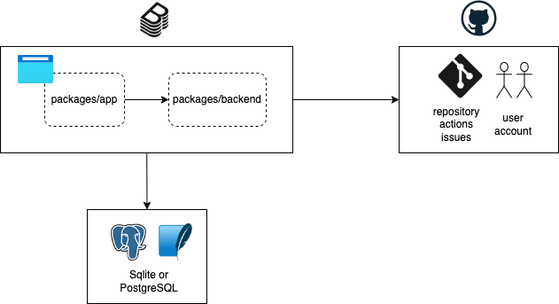

# chocott-backstage

chocott-backstage（ちょこっとBackstage）は、[Backstage](https://backstage.io)をすぐに試せるテンプレートリポジトリです。

> **👉 すぐに試したい方は [Quick Startガイド](./chocott-contents/docs/quick-start/index.md) へ**

## ちょこっとBackstageとは

[Backstage](https://backstage.io)は、[Spotify](https://newsroom.spotify.com/company-info/)が開発しCNCFで管理されているオープンソースの開発者ポータルプラットフォームです。  
ソフトウェアカタログやテンプレート、ドキュメントなどを一元管理し、開発チームの生産性向上を支援します。

chocott-backstageは、そんなBackstageを **「ちょこっと」** 試してみたい方に向けて、GitHub連携機能をすぐに体験できるように構成した環境です。  
docker composeで手軽にBackstageを立ち上げることができます。

### 主な特徴

- 🚀 **すぐに使える** - docker composeコマンドひとつでBackstageが起動
- 🔗 **GitHubプラグイン実装済み** - GitHubのPluginを組み込み済みで、ソフトウェアカタログやテンプレート機能をすぐに体験可能
- 👥 **Organizationアカウントでもパーソナルアカウントでも利用可能** - チームでの検証による利用も、個人での検証・学習目的の利用にも対応
- 📝 **カスタマイズ可能** - GitHubテンプレートリポジトリとして提供。自分だけのBackstage環境を構築可能
- 📖 **日本語ドキュメント** - セットアップ手順から各機能の説明まで日本語ドキュメントを用意

## なぜchocott-backstageを作ったのか

Backstageの利用を開始するには[公式ドキュメント(Getting Started)](https://backstage.io/docs/getting-started/)にしたがってアプリケーションを生成し、データベースを用意し、各種連携システムの設定を行い、利用するBackstage pluginを導入するなどのいくつかのステップを踏まなければなりません。もちろん開発環境なども準備する必要があります。

この作業が「試したいだけなのに面倒だな」と感じる方も多くいらっしゃると思います。こうした方に向けてこのリポジトリを作成しました。

このリポジトリのコードは以下のことを行った状態になっています。

- Backstageアプリケーションの生成
- GitHubの一部Pluginコードを組み込み
- PostgreSQL Serverを利用するためのコード修正
- Backstageのコンフィグレーション
- Backstageのコンテナイメージ作成
- ローカル環境利用のためのDocker composeファイルの用意

利用するためにはGitHub Appの登録をし、環境変数にいくつかの項目を設定していただく必要はありますが、あとはdocker composeコマンドを実行するだけでBackstageのGitHub連携機能まですぐにお試しいただくことができます。

生成したソースコードもリポジトリにありますので、コードを修正しながらお試しいただくこともできます。お好みのPluginを独自に組み込みお試しいただくなどすることも可能です。  
ぜひBackstageを利用して、その価値を感じて頂きたいと思います。

## システム構成

chocott-backstageに関する詳細な情報は[docs](./chocott-contents/docs/index.md)をご参照ください。

## 関連サービス

chocott-backstageの管理を行っている株式会社エーピーコミュニケーションズでは、Backstageのマネージドサービス「**PlaTT**」を提供しています。  
ご興味のある方はぜひご覧ください。

[**PlaTT - 開発生産性を最大化する開発者のためのポータルサイト**](https://www.ap-com.co.jp/platt/)