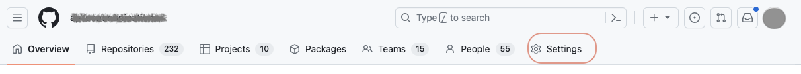
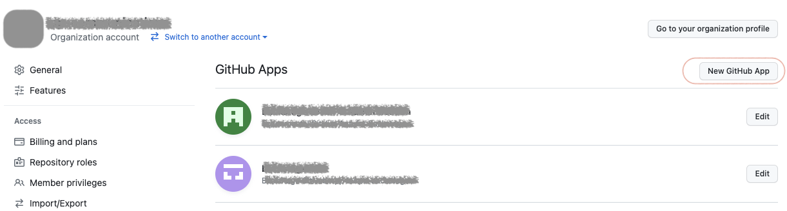
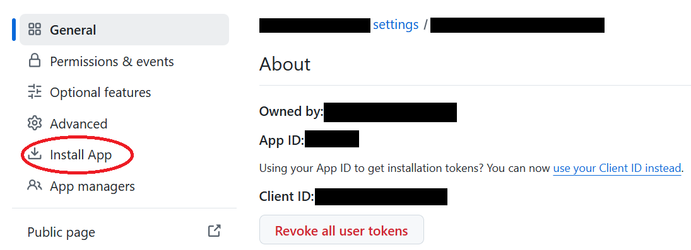
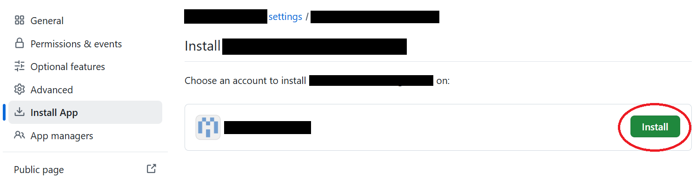
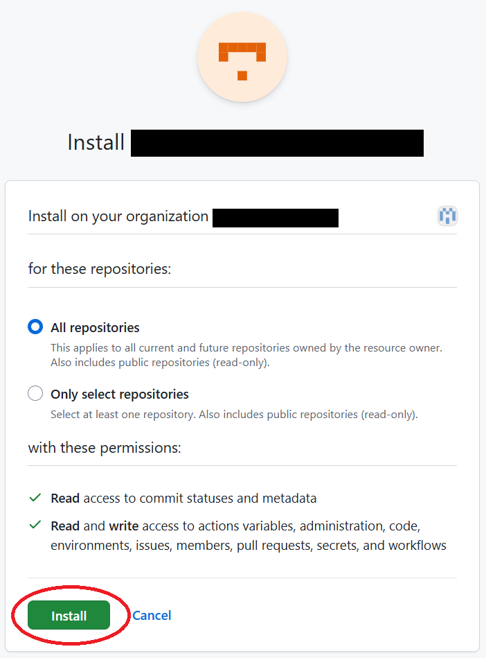

# GitHub Appの登録（Organizationアカウント）

chocott-backstageはGitHubを利用してユーザーの認証を行います。GitHubで認証を行うにはGitHub Appの登録が必要になります。GitHub Appの登録にはそのアカウントのオーナー権限が必要です。

以下の手順にそってGitHub Appを作成してください。  
作成したGitHub App登録を行った組織／ユーザーが所有するリポジトリにアクセスすることができます（orgAという組織に登録した場合は `orgA/repository` に、userXというパーソナルアカウントに登録した場合は `userX/repository` にアクセス可能となります）。
GitHub App作成の詳細については[GitHub Docs](https://docs.github.com/ja/apps/creating-github-apps/registering-a-github-app/registering-a-github-app) をご参照願います。

## 1. SettingsからGitHub App作成画面に遷移

Organizationのページ `https://github.com/<Organization名>` にアクセスし、「Settings」を選択します。

「Settings」が表示されたら、左側サイドメニューの下にある「Developer settings」を選択しさらに表示される「GitHub Apps」を選択します。

GitHub Apps一覧が表示されたら、右上の「New GitHub App」ボタンをクリックします。

## 2. GitHub Appの作成

GitHub Appの登録画面が表示されますので必要な情報を入力します。以下はBackstageをローカルPC上で動かすことを想定した内容となっています。

| 項目名 | 内容 |
|-------|------|
|GitHub App name|GitHub Appとして登録するアプリケーション名を指定します。GitHub App名はGitHub全体でグローバルに一意である必要があります。|

| 項目名 | 内容 |
|-------|------|
|Homepage URL| `http://localhost:3000` |
|Callback URL| `http://localhost:7007/api/auth/github/handler/frame` |
|Expire user authentication tokens|チェックしたままでよいです。|
|Request user authorization (OAuth) during installation| チェックします。 |

**【Webhook】**

Webhookは現在使用していませんので、「Active」のチェックを外してください。

**【Permission】**

以下の項目のパーミッションを設定します。いずれもRepository permissionsに分類されています。  
（設定する必要があるパーミッションのみをリストで表示しています）

| 項目名 | 指定内容 | 備考 |
|-------|---------|-----|
| Administration | Read & write | リポジトリ作成のため |
| Commit statuses | Read-only | |
| Contents | Read & write | |
| Environments | Read & write | テンプレートでGitHub Environmentsを作成する場合 |
| Issues | Read & write | |
| Members |Read-only | |
| Metadata |Read-only | |
| Pull requests | Read & write | |
| Secrets | Read & write | テンプレートでGitHub Action Repository Secretsを作成する場合 |
| Variables | Read & write | テンプレートでGitHub Action Repository Variablesを作成する場合 |
| Workflows | Read & write | テンプレートでWorkflowを作成する場合 |

最後に `only on this account` を選択します。

入力が完了したら `Create GitHub App` ボタンをクリックします。

## 3. Client secretの作成

アプリケーションが作成されたら、まずApp IDおよびClient IDを確認し、メモしておきましょう。  
その後、`Generate a new client secret` をクリックします。

シークレットが作成されますので、表示されているClient secretをメモします。  
（Client secretはこの画面でのみ表示されるため、ご注意ください）

## 4. App Install

シークレットキーの作成まで完了したら、GitHub Appをインストールします。  
GitHub Appの設定画面のサイドメニューで「Install App」を選択し、「Install」ボタンを実行してください。

### GitHub Appのインストール

シークレットキーの作成まで完了したら、GitHub Appをインストールします。  
画面左にある「Install App」をクリックします。

作成したGitHub App名横の「Install」ボタンをクリックします。

インストール時に「All repositories」または「Only select repositories」を選択できます。  
ここでは「All repositories」を選択し、「Install」をクリックします。

**なぜ「All repositories」を選択するのか？**  
Backstageのソフトウェアテンプレート機能を使用してリポジトリを新規作成する場合、作成先のリポジトリに対してGitHub Appのアクセス権が必要になります。  
「Only select repositories」を選択した場合、新規作成したリポジトリは自動的にアクセス対象に含まれないため、テンプレートからのリポジトリ作成時にエラーが発生します。  
「Only select repositories」を選択する場合は、Backstageで管理するすべてのリポジトリを手動で追加する必要があります。また、テンプレートで新規リポジトリを作成した後は、GitHub Appの設定画面から手動でそのリポジトリを追加してください。

「Install」をクリックすると、Callback URLに設定したURLに自動遷移しますが、この時点ではBackstageを起動していないためエラーになります。  
`https://github.com/organizations/<GitHub Organization名>/settings/installations`にアクセスすると、インストール済みのGitHub Appの一覧が表示されている「Installed Actions」のページが表示されます。  
このリスト内に今回新規作成したGitHub Appが存在していれば、存在していれば、インストールは問題なく完了しています。

## 5. まとめ（取得した情報の確認）

以下の値をそれぞれ取得できているかどうか確認してください。  

- App IDの文字列
- Client IDの文字列
- Client Secretの文字列

## 作業完了後の手順

- 「**Organizationアカウントでchocott-backstageを立ち上げる**」で作業をされていた方は、[2. GitHub Credentialファイルの作成](../../../quick-start/organization.md#2-github-credentialファイルの作成)の手順から作業を続けてください。