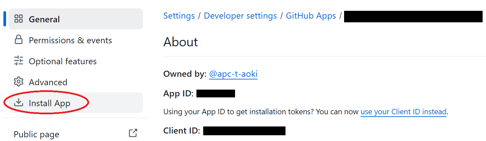
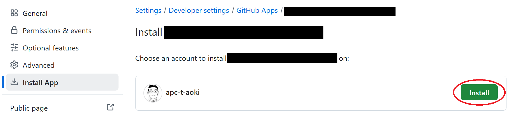
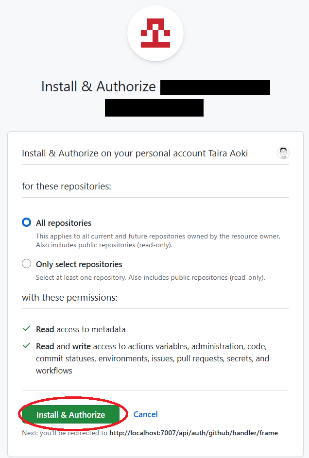
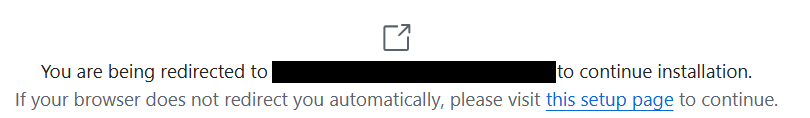
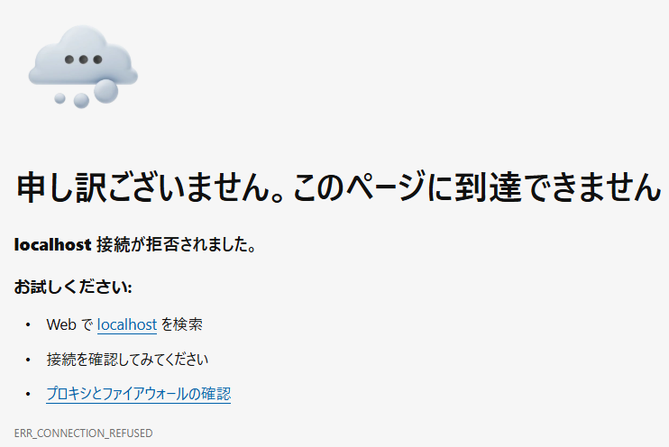
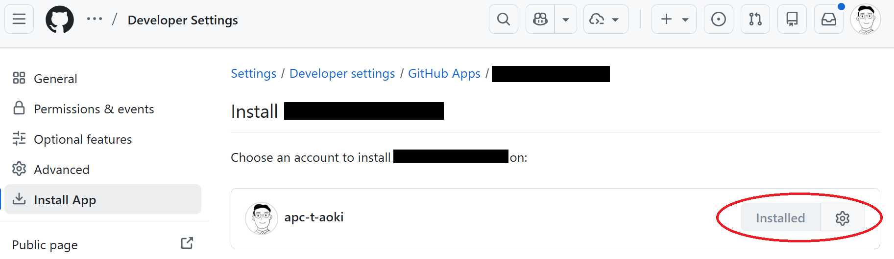

# GitHub Appの登録（パーソナルアカウント）

chocott-backstageはGitHubを利用してユーザーの認証を行います。GitHubで認証を行うにはGitHub Appの登録が必要になります。GitHub Appの登録にはそのアカウントのオーナー権限が必要です。

以下の手順にそってGitHub Appを作成してください。  
GitHub App作成の詳細については[GitHub Docs](https://docs.github.com/ja/apps/creating-github-apps/registering-a-github-app/registering-a-github-app) をご参照願います。

## 1. SettingsからGitHub App作成画面に遷移

GitHubにアクセスし右上のユーザーアイコンをクリックします。

設定ダイアログが開きますので、「Settings」を選択します。

「Settings」画面が開きましたら、左側サイドメニューの一番下にある「Developer settings」を選択します。

アプリケーション一覧が表示されます。左側サイドメニューで「GitHub Apps」を選択してGitHub Apps一覧画面を表示し、右上の「New GitHub App」ボタンをクリックします。

## 2. GitHub Appの作成

GitHub Appの登録画面が表示されますので必要な情報を入力します。以下はBackstageをローカルPC上で動かすことを想定した内容となっています。

| 項目名 | 内容 |
| ------- | ------ |
| GitHub App name | GitHub Appとして登録するアプリケーション名を指定します。GitHub App名はGitHub全体でグローバルに一意である必要があります。 |

| 項目名 | 内容 |
| ------- | ------ |
| Homepage URL | `http://localhost:3000` |
| Callback URL | `http://localhost:7007/api/auth/github/handler/frame` |
| Expire user authentication tokens | チェックしたままでよいです。 |
| Request user authorization (OAuth) during installation | チェックします。 |

**【Webhook】**

Webhookは現在使用していませんので、「Active」のチェックを外してください。

**【Permission】**

以下のパーミッションのみを設定します。  
※パーソナルアカウントでの利用では、GitHub AppはOAuthによるユーザー認証のみに使用します。バックエンドのGitHub連携はPATが担うため、リポジトリ操作の権限は不要です。

| 項目名 | 指定内容 | 備考 |
| ------- | --------- | ----- |
| Metadata | Read-only | GitHub App動作に必要な最小権限 |

最後に `only on this account` を選択します。

入力が完了したら `Create GitHub App` ボタンをクリックします。

## 3. Client secretの作成

アプリケーションが作成されたら、まずClient IDを確認し、メモしておきましょう。（個人アカウント利用の場合はApp IDは不要です）  
その後、`Generate a new client secret` をクリックします。

シークレットが作成されますので、表示されているClient secretをメモします。  
（Client secretはこの画面でのみ表示されるため、ご注意ください）

## 4. GitHub AppのInstall

シークレットキーの作成まで完了したら、GitHub Appをインストールします。  
画面左にある「Install App」をクリックします。

作成したGitHub App名横の「Install」ボタンをクリックします。

インストール時に「All repositories」または「Only select repositories」を選択できます。  
ここでは「All repositories」を選択し、「Install & Authorize」をクリックします。

**なぜ「All repositories」を選択するのか？**  
Backstageのソフトウェアテンプレート機能を使用してリポジトリを新規作成する場合、作成先のリポジトリに対してGitHub Appのアクセス権が必要になります。  
「Only select repositories」を選択した場合、新規作成したリポジトリは自動的にアクセス対象に含まれないため、テンプレートからのリポジトリ作成時にエラーが発生します。  
「Only select repositories」を選択する場合は、Backstageで管理するすべてのリポジトリを手動で追加する必要があります。また、テンプレートで新規リポジトリを作成した後は、GitHub Appの設定画面から手動でそのリポジトリを追加してください。

「Install & Authorize」をクリックすると、Callback URLに設定したURLに自動遷移することがありますが、この時点ではBackstageを起動していないためエラーになります。  
以下のようなエラー画面が表示されますので、`https://github.com/settings/apps/<GitHub App名>/installations`のURLにアクセスしてください。

以下のように「Installed」と表示されていれば、GitHub Appのインストールは完了です。

## 5. まとめ（取得した情報の確認）

以下の値をそれぞれ取得できているかどうか確認してください。  

- Client IDの文字列
- Client Secretの文字列

## 作業完了後の手順

- 「**パーソナルアカウントでchocott-backstageを立ち上げる**」で作業をされていた方は、[2. GitHub PATの取得](../../../quick-start/personal.md#2-github-patの取得)の手順から作業を続けてください。
