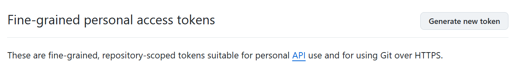
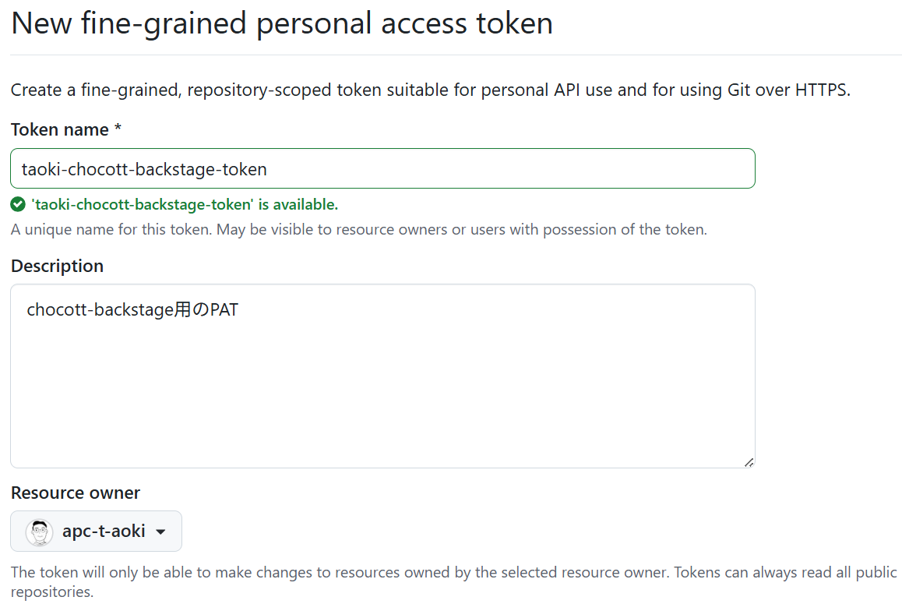
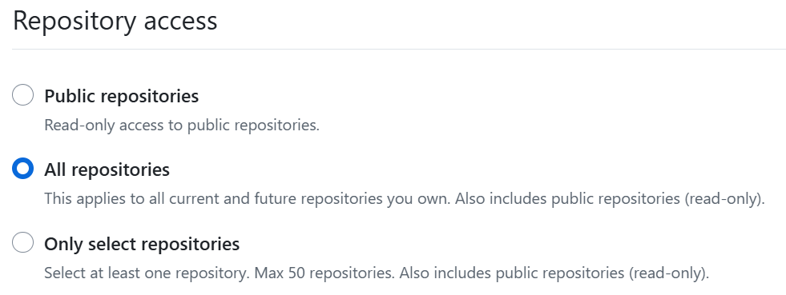
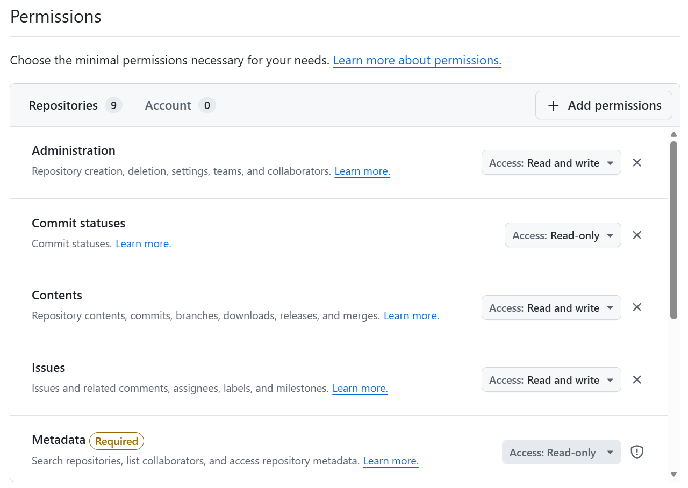
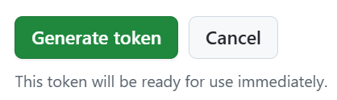
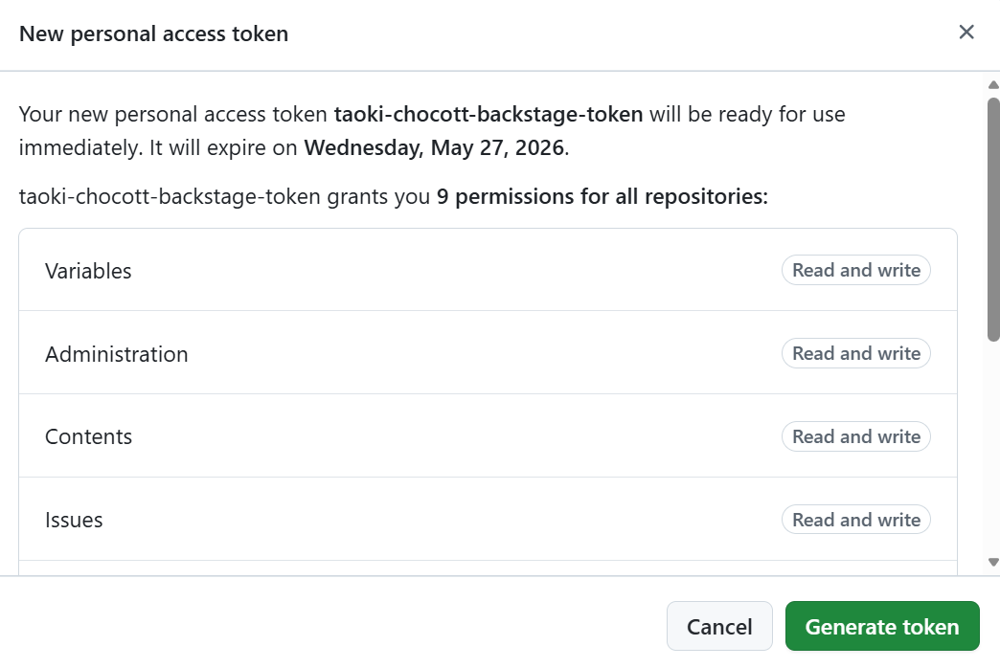
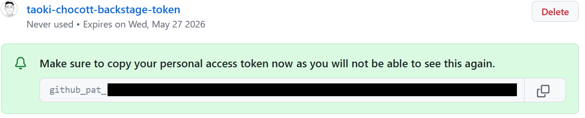

# GitHub PATの取得

パーソナルアカウントでchocott-backstageを利用する場合、GitHubのFine-grained personal access token（PAT）を使用してGitHubリポジトリにアクセスします。

## PATの作成手順

GitHubにサインインし、[Fine-grained personal access tokens](https://github.com/settings/personal-access-tokens) にアクセスします。

「Generate new token」を選択します。

以下のように設定を行います。

| 項目名 | 入力内容 |
|-------|------|
|Token name| <トークン名として任意の文字列> |
|Description| <任意の文字列> |
|Resource owner| <自身のアカウント> |
|Expiration| <トークンの利用期限> |

**Repository access**は「All repositories」を選択します。

**Permissions**では以下の項目のパーミッションを設定します。  

| 項目名 | 指定内容 | 備考 |
|-------|---------|-----|
| Administration | Read & write | リポジトリ作成のため |
| Commit statuses | Read-only | |
| Contents | Read & write | |
| Environments | Read & write | テンプレートでGitHub Environmentsを作成する場合 |
| Issues | Read & write | |
| Members |Read-only | |
| Metadata |Read-only | |
| Pull requests | Read & write | |
| Secrets | Read & write | テンプレートでGitHub Action Repository Secretsを作成する場合 |
| Variables | Read & write | テンプレートでGitHub Action Repository Variablesを作成する場合 |
| Workflows | Read & write | テンプレートでWorkflowを作成する場合 |

「Generate token」を選択します。

PATに付与するPermissionsの設定を確認したうえで、Generate tokenをクリックします。  
PATの場合は一度作成してからPermissionの設定を変更することができないので、間違えないようにご注意ください。

作成が完了したらトークンが払い出されますので、この値をメモしておきましょう。

