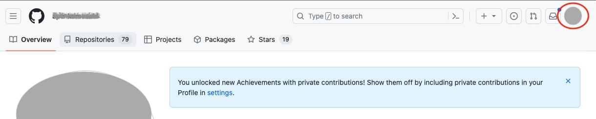
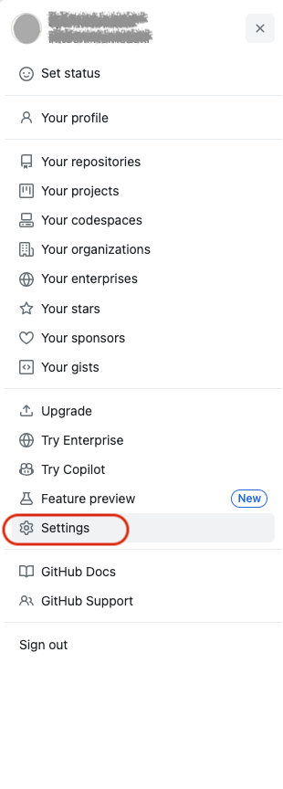
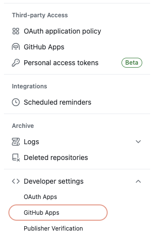
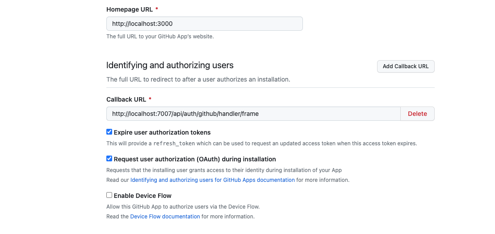
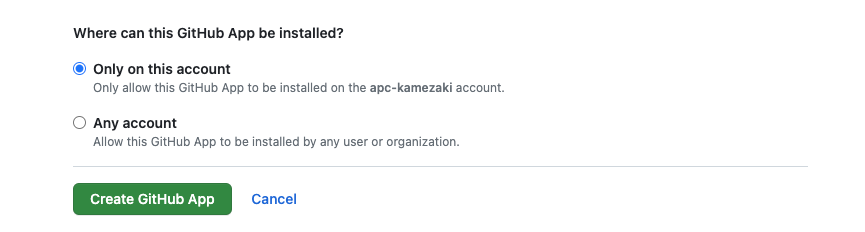
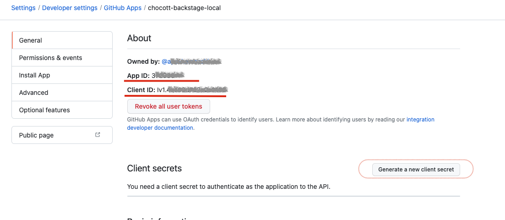
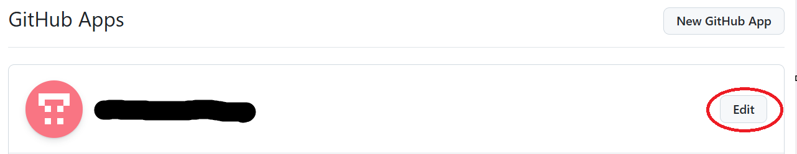
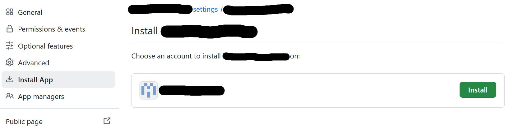
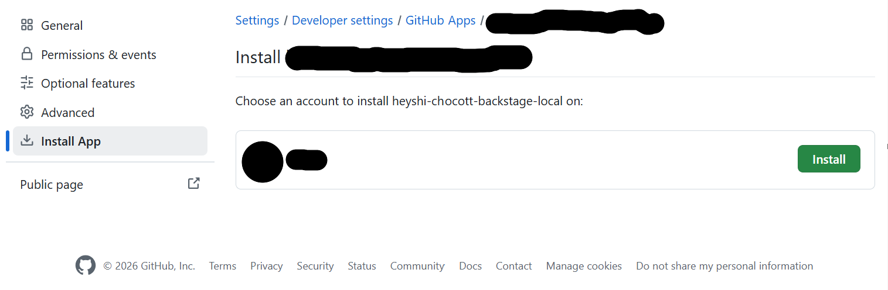
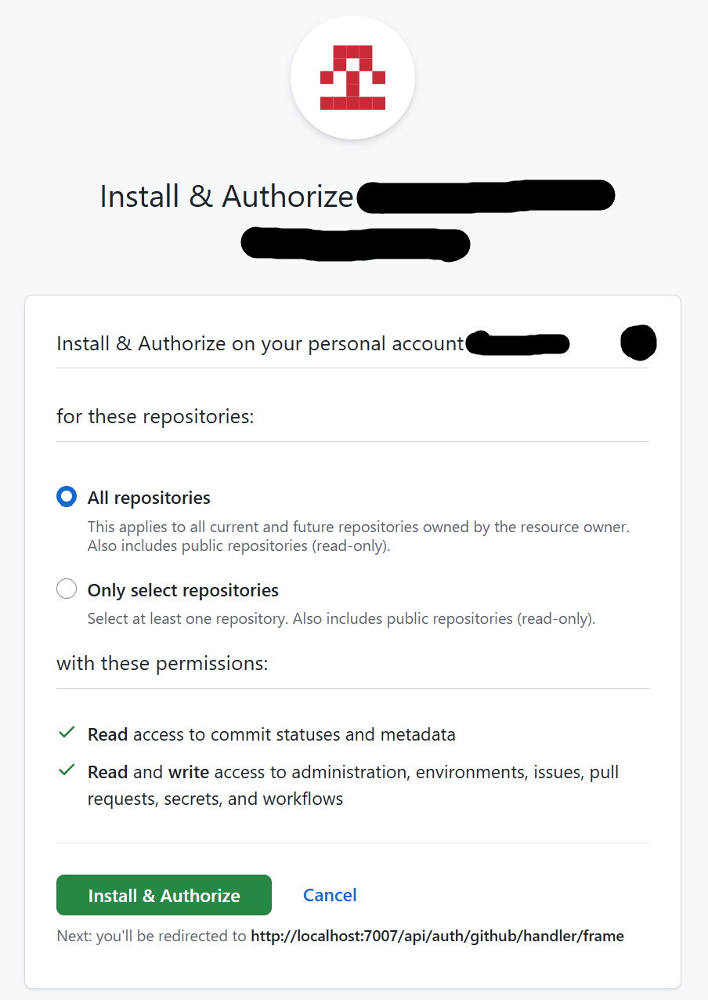

# GitHub Appの登録

chocott-backstageはGitHubを利用してユーザーの認証を行います。GitHubで認証を行うにはGitHub Appの登録が必要になります。GitHub Appの登録にはそのアカウントのオーナー権限が必要です。

以下の手順にそってGitHub Appを作成してください。
作成したGitHub App登録を行った組織／ユーザーが所有するリポジトリにアクセスすることができます（orgAという組織に登録した場合は `orgA/repository` に、userXというパーソナルアカウントに登録した場合は `userX/repository` にアクセス可能となります）。
GitHub App作成の詳細については[GitHub Docs](https://docs.github.com/ja/apps/creating-github-apps/registering-a-github-app/registering-a-github-app) をご参照願います。

## 1. Settingsからアカウント作成画面に遷移

### パーソナルアカウントに作成する場合

GitHubにアクセスし右上のユーザーアイコンをクリックします。



設定ダイアログが開きますので、「Settings」を選択します。



「Settings」画面が開きましたら、左側サイドメニューの一番下にある「Developer settings」を選択します。


アプリケーション一覧が表示されます。左側サイドメニューで「GitHub Apps」を選択してGitHub Apps一覧画面を表示し、右上の「New GitHub App」ボタンをクリックします。


### Organization（組織）アカウントに作成する場合

Organizationのページ `https://github.com/<Organization名>` にアクセスし、「Settings」を選択します。


「Settings」が表示されたら、左側サイドメニューの下にある「Developer settings」を選択しさらに表示される「GitHub Apps」を選択します。



GitHub Apps一覧が表示されたら、右上の「New GitHub App」ボタンをクリックします。


## 2. GitHubApp作成

GitHub Appの登録画面が表示されますので必要な情報を入力します。以下はBackstageをローカルPC上で動かすことを想定した内容となっています。

| 項目名 | 内容 |
|-------|------|
|GitHub App name|GitHub Appとして登録するアプリケーション名を指定します。ここでは`chocott-backstage-local` とします。なお、GitHub App名はGitHub全体でグローバルに一意である必要があります。すでに使用されている場合は `chocott-backstage-local-<your-username>` のようにご自身のユーザー名などを付加して一意な名前にしてください。 |


| 項目名 | 内容 |
|-------|------|
|Homepage URL| `http://localhost:3000` と指定します。 |
|Callback URL| `http://localhost:7007/api/auth/github/handler/frame` と指定します。|
|Expire user authentication tokens|チェックしたままとします。|
|Request user authorization (OAuth) during installation| チェックします。 |



**【Permission】**

以下の項目のパーミッションを設定します。

| 項目名 | 指定内容 | 備考 |
|-------|---------|-----|
| Administration | Read & write | リポジトリ作成のため |
| Commit statuses | Read-only | |
| Contents | Read & write | |
| Environments | Read & write | テンプレートでGitHub Environmentsを作成する場合 |
| Issues | Read & write | |
| Members |Read-only | |
| Metadata |Read-only | |
| Pull requests | Read & write | |
| Secrets | Read & write | テンプレートでGitHub Action Repository Secretsを作成する場合 |
| Variables | Read & write | テンプレートでGitHub Action Repository Variablesを作成する場合 |
| Workflows | Read & write | テンプレートでWorkflowを作成する場合 |


**【Webhook】**

Webhookは現在使用していませんので、「Active」のチェックを外してください。

最後に `only on this account` を選択します。



入力が完了したら `Create GitHub App` ボタンをクリックします。

## 3. シークレットキー作成

アプリケーションが作成されたら `Generate a new client secret` をクリックします。



シークレットが作成されますので、表示されているClient IDとシークレット文字列をメモします。

## 4. App Install

シークレットキーの作成まで完了したら、GitHub Appをインストールします。  
GitHub Appの設定画面のサイドメニューで「Install App」を選択し、「Install」ボタンを実行してください。

### Organizationアカウントに作成した場合

Organizationのページ `https://github.com/<Organization名>` にアクセスし、「Settings」を選択します。


「Settings」が表示されたら、左側サイドメニューの下にある「Developer settings」を選択しさらに表示される「GitHub Apps」を選択します。


GitHub Apps一覧が表示されたら、右上の「Edit」ボタンをクリックします。



インストール対象とするOrganizationを選択し「Install」ボタンを実行してください。



### パーソナルアカウントに作成した場合

`https://github.com/settings/profile`にアクセスし、「Developer settings」をクリックします。


作成したGitHub App名横の「Install」ボタンを実行してください。



### GitHub Appインストール時のリポジトリの範囲について

インストール時に「All repositories」または「Only select repositories」を選択できます。



ここでは、**「All repositories」を選択することを推奨します。**

理由：Backstageのソフトウェアテンプレート機能を使用してリポジトリを新規作成する場合、作成先のリポジトリに対してGitHub Appのアクセス権が必要になります。「Only select repositories」を選択した場合、新規作成したリポジトリは自動的にアクセス対象に含まれないため、テンプレートからのリポジトリ作成時にエラーが発生します。

「Only select repositories」を選択する場合は、Backstageで管理するすべてのリポジトリを手動で追加する必要があります。また、テンプレートで新規リポジトリを作成した後は、GitHub Appの設定画面から手動でそのリポジトリを追加してください。


## 5. 環境変数に登録

Backstage Appで利用するため、登録したGitHub Appの情報を環境変数に登録し、
Backstageを起動します。

```bash
export AUTH_GITHUB_CLIENT_ID="<Client IDの文字列>"
export AUTH_GITHUB_CLIENT_SECRET="<Secretの文字列>"

```