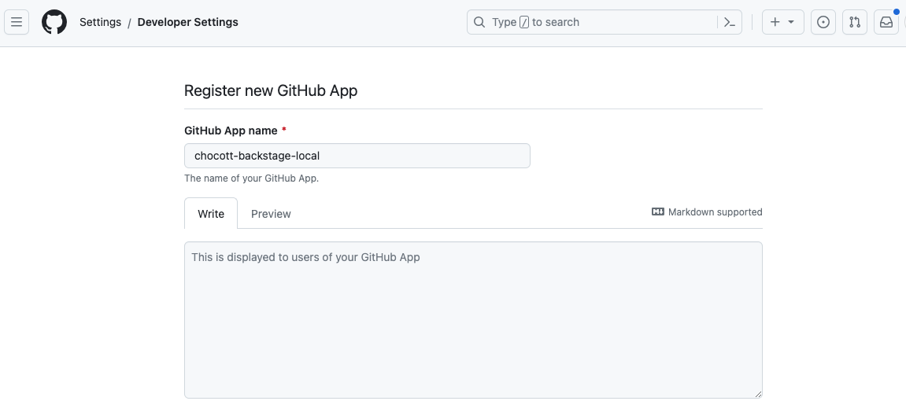

# GitHub Appの登録

chocott-backstageはGitHubを利用してユーザーの認証を行います。GitHubで認証を行うにはGitHub Appの登録が必要になります。GitHub Appの登録にはそのアカウントのオーナー権限が必要です。

以下の手順にそってGitHub Appを作成してください。
作成したGitHub App登録を行った組織／ユーザーが所有するリポジトリにアクセスすることができます（ orgA という組織に登録した場合は `orgA/repository` に、 userX というパーソナルアカウントに登録した場合は `userX/repsitory` にアクセス可能となります）。
GitHub App作成の詳細については[GitHub Docs](https://docs.github.com/ja/apps/creating-github-apps/registering-a-github-app/registering-a-github-app) をご参照願います。

## Settingsからアカウント作成画面に遷移

### パーソナルアカウントに作成する場合

GitHubにアクセスし右上のユーザーアイコンをクリックします。


設定ダイアログが開きますので、「Settings」を選択します。


「Settings」画面が開きましたら、左側サイドメニューの一番したにある「Developer settings」を選択します。


アプリケーション一覧が表示されます。左側サイドメニューで「GitHub Apps」を選択してGitHub Apps一覧画面を表示し、右上の「New GitHub App」ボタンをクリックします。


### 組織アカウントに作成する場合

組織ページ `https://github.com/<組織名>` にアクセスし、「Settings」を選択します。


「Settings」が表示されたら、左側サイドメニューの下にある「Developer settings」を選択しさらに表示される「GitHub Apps」を選択します。


GitHub Apps一覧が表示されるので、右上の「New GitHub App」ボタンをクリックします。


## GitHubApp作成

GitHub Appの登録画面が表示されますので必要な情報を入力します。以下はBackstageをローカルPC上で動かすことを想定した内容となっています。

| 項目名 | 内容 |
|-------|------|
|GitHub App name|GitHub Appとして登録するアプリケーション名を指定します。ここでは`chocott-backstage-local` とします。 |



| 項目名 | 内容 |
|-------|------|
|Homepage URL| `http://localhost:3000` と指定します。 |
|Callback URL| `http://localhost:7007/api/auth/github/handler/frame` と指定します。|
|Expire user authentication tokens|チェックしたままとします。|
|Request user authorizatio(OAuth) during installation| チェックします。 |


**【Permission】**

以下の項目のパーミッションを設定します。

| 項目名 | 指定内容 | 備考 |
|-------|---------|-----|
| Administration | Read & write | リポジトリ作成のため |
| Commint statuses | Read-only | |
| Contents | Read & write | |
| Environments | Read & write | テンプレートでGitHub Environmentsを作成する場合 |
| Issues | Read & write | |
| Members |Read-only | |
| Metadata |Read-only | |
| Pull requests | Read & write | |
| Secrets | Read & write | テンプレートでGitHub Action Repository Secretsを作成する場合 |
| Variables | Read & write | テンプレートでGitHub Action Repository Variablesを作成する場合 |
| Workflows | Read & write | テンプレートでWorkflowを作成する場合 |


**【Webhook】**

以下のイベントを登録します。

TBD

最後に `only on this account` を選択します。


入力が完了したら `Create GitHub App` ボタンをクリックします。

## シークレットキー作成

アプリケーションが作成されたら `Generate a new client secret` をクリックします。


シークレットが作成されますので、表示されている Client IDとシークレット文字列をメモします。


## App Install

シークレットキーの作成まで完了したら、GitHub Appをインストールします。  
GitHub Appの設定画面のサイドメニューで「Install App」を選択し、インストール対象とする組織を選択し「Install」ボタンを実行してください。


## 環境変数に登録

Backstage Appで利用するため、登録したGitHub Appの情報を環境変数に登録し、
Backstageを起動します。

```bash
export AUTH_GITHUB_CLIENT_ID="<Client IDの文字列>"
export AUTH_GITHUB_CLIENT_SECRET="<Secretの文字列>"

```

## サインイン

### パーミッションの確認

GitHubアカウントで最初にサインインする際、以下のようなダイアログが表示されます。表示されましたら「Authorize ... 」のボタンをクリックしてください。2回目のサインイン時には表示されません。

