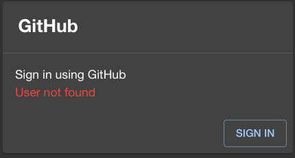

# Authorization

アクセスの承認はBackstage内で管理するユーザー情報・グループ情報を用いて行います。
GitHub Appを組織アカウントに登録した場合、ユーザー・グループ情報はGitHubのユーザー・チームの情報と同期することができます。以下にに沿って、同期機能を有効にしてください。

## 承認処理の有効化

Backstageのコードを作成した直後は以下のようになっています。
参考 : [Backstage document](https://backstage.io/docs/auth/identity-resolver)


```typescript
// File: packages/backend/src/plugins/auth.ts
export default async function createPlugin(
  // ...
  return await createRouter({
    // ...
    providerFactories: {
      // ...
      github: providers.github.create({
        signIn: {
          resolver(_, ctx) {
            const userRef = 'user:default/guest'; // Must be a full entity reference
            return ctx.issueToken({
              claims: {
                sub: userRef, // The user's own identity
                ent: [userRef], // A list of identities that the user claims ownership through
              },
            });
          },
          // resolver: providers.github.resolvers.usernameMatchingUserEntityName(),
        },
    }
  })
)
```

この `github: providers.github.create()` はGitHubでサインインを行った直後、GitHub側から処理が戻ってきたときに実行されるコードです。

```typescript

            const userRef = 'user:default/guest'; // Must be a full entity reference
            return ctx.issueToken({
              claims: {
                sub: userRef, // The user's own identity
                ent: [userRef], // A list of identities that the user claims ownership through
              },
            });

```

この部分でサインインしたユーザーをBackstageのゲストユーザーとして承認しトークンを発行します。
GitHub AuthenticationはGitHubに登録されたユーザーかどうかを確認しているだけなので、このままでは誰でもBackstageを利用できてしいまいます。ここで承認処理を追加します。

```typescript
          // resolver(_, ctx) {
          //   const userRef = 'user:default/guest'; // Must be a full entity reference
          //   return ctx.issueToken({
          //     claims: {
          //       sub: userRef, // The user's own identity
          //       ent: [userRef], // A list of identities that the user claims ownership through
          //     },
          //   });
          // },
          resolver: providers.github.resolvers.usernameMatchingUserEntityName(),

```

有効になっていた部分をコメントアウトし、 `resolver: providers.github.resolvers.usernameMatchingUserEntityName(),` の部分を有効にします。これによって、Backstage側に登録されているユーザーのみがBackstageの利用を承認されることになります。

最新のコードは [こちら](https://github.com/ap-communications/chocott-backstage/blob/main/packages/backend/src/plugins/auth.ts) です。

## ユーザー情報の登録

上記の修正を行いサインインを実行すると以下のように、「User not found」になります。これはユーザーがBackstage側に登録されていないからです。



通常、ユーザー情報はGitHubの組織情報からインポートします。参考資料: [GitHub Organization Data](https://backstage.io/docs/integrations/github/org)

こちらのドキュメントに沿って、データインポート用のコードを実装します。

### 組織データのインポート

組織データのインポートは [@backstage/plugin-catalog-backend-module-github] Pluginを使用します。
インポートはBackstageからGitHubに対して定期的なfetchを行う方法と、GitHub Webhookによりインポートとする方法があります。
ここでは定期的なfetchを行う方法について記載いします（Webhookの追加方法については [Backstage document](https://backstage.io/docs/integrations/github/org/#installation-with-events-support) をご確認ください）


```typescript
// File: packages/backend/src/plugins/catalog.ts

import { GithubMultiOrgEntityProvider } from '@backstage/plugin-catalog-backend-module-github';

export default async function createPlugin(
  env: PluginEnvironment,
): Promise<Router> {
  const builder = await CatalogBuilder.create(env);

  // The GitHub URL below needs to match a configured integrations.github entry
  // specified in your app-config.
  builder.addEntityProvider(
    GithubMultiOrgEntityProvider.fromConfig(env.config, {
      id: 'production',
      githubUrl: 'https://github.com',
      // Set the following to list the GitHub orgs you wish to ingest from. You can
      // also omit this option to ingest all orgs accessible by your GitHub integration
      orgs: ['org-a', 'org-b'],
      logger: env.logger,
      schedule: env.scheduler.createScheduledTaskRunner({
        frequency: { minutes: 60 },
        timeout: { minutes: 15 },
      }),
    }),
  );

  // ..
}

```


chocott-backstageでは、コンフィグレーションファイルでorgsの内容を指定できるように修正しています。

```yaml
// File: app-config.local.yaml
catalog:
  providers:
    githubOrg:
      id: 'production'
      orgs: [ 'org-a', 'org-b' ]

```

上記の内容を修正・追加することで GitHubから組織情報を取得するようになります。（上記の例では1時間ごとにデータを取得します）

あらためてサインインをしてみると、今度は正常にアクセスできると思います。

最新のコードは [こちら](https://github.com/ap-communications/chocott-backstage/blob/main/packages/backend/src/plugins/catalog.ts) です。

## パーソナルアカウントにGitHub Appを登録した場合

パーソナルアカウントにGitHub Appを登録した場合には、ユーザー・チーム情報をBackstageに取り込むことができませんコンフィグレーション(`$TOP/app-config.local.yaml` や `chocott-contents/deploy/app-config.chocott.yaml`)のcatalog.providers.gitHubOrgの項目をコメントアウトしてください。

```yaml
catalog:
  # 個人アカウントにGitHub Appを作成した場合はproviders.githubOrgの項目をコメントアウトしてください
  providers:
    # 下記をコメントアウト
    # githubOrg:
    #   id: 'github-local'
    #   orgs:
    #   - ${GITHUB_ORG}

```

この場合は、GitHubアカウントを持っているすべての方がBackstageにサインイン可能となりますのでご利用の際はご注意ください。
