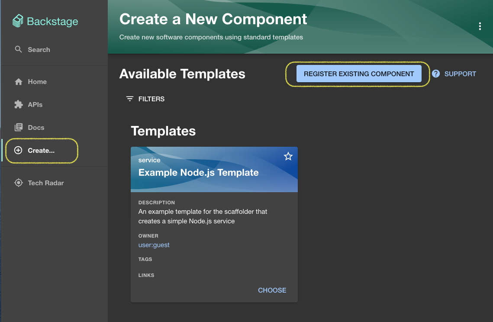
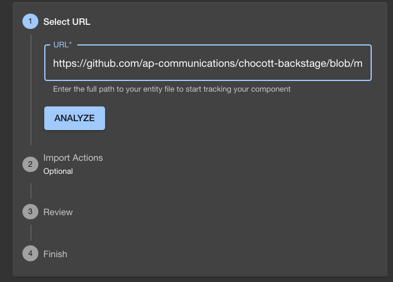
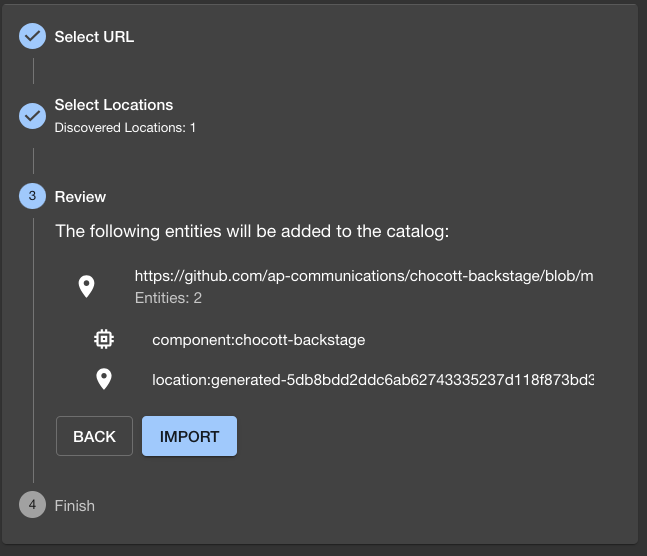
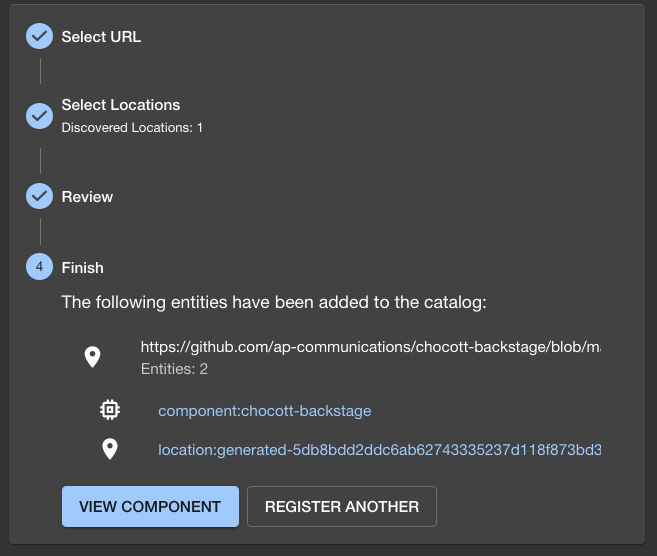
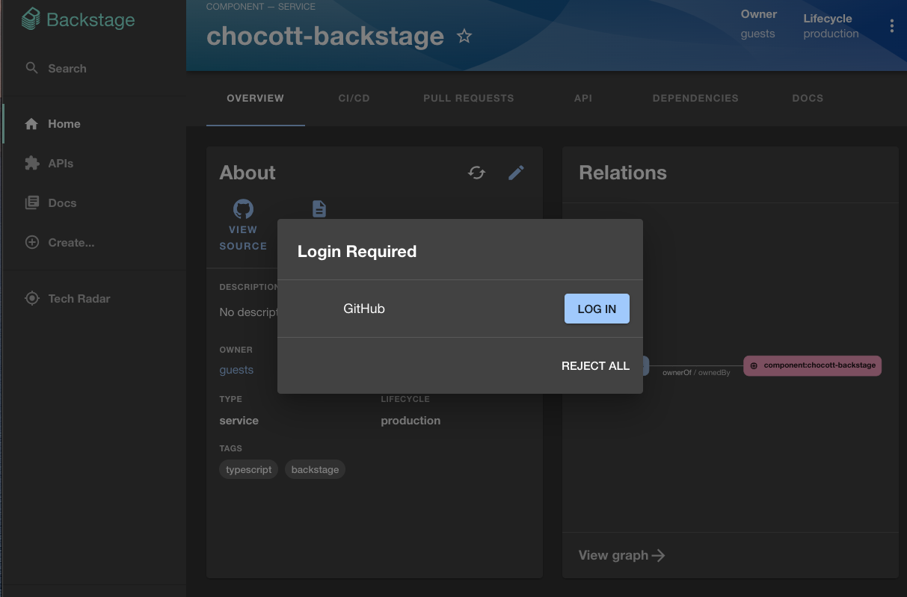
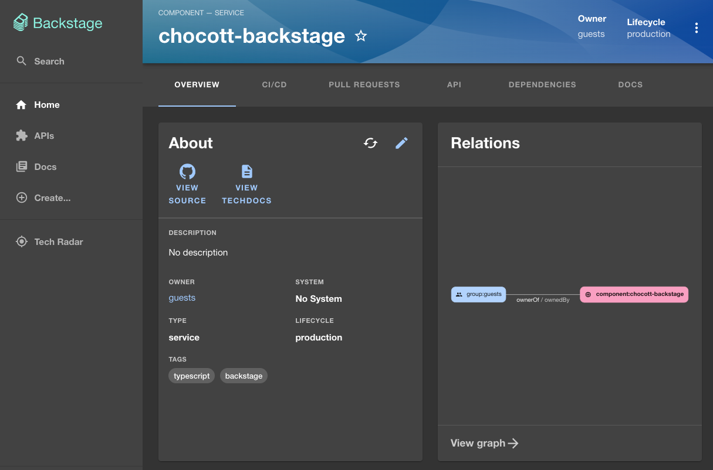
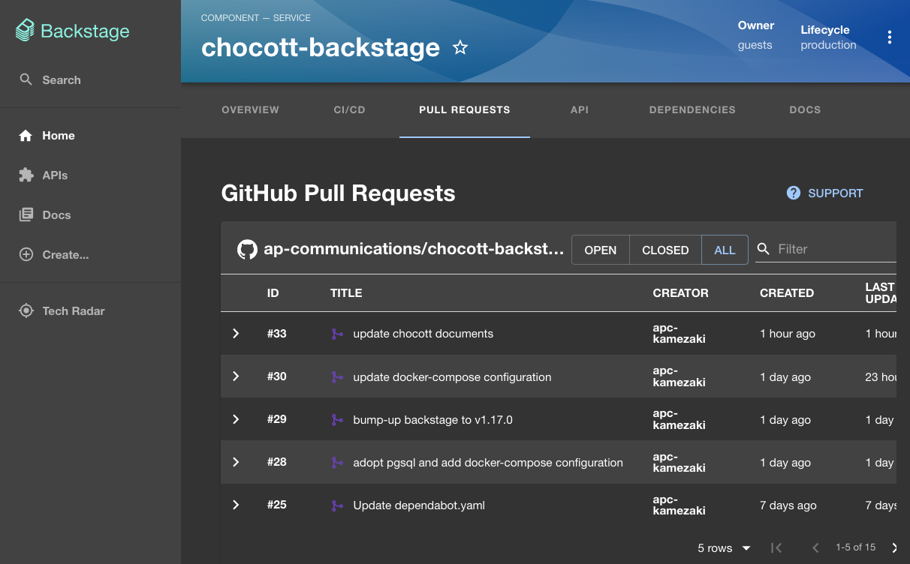

# ソフトウェアカタログ

[ソフトウェアカタログ](https://backstage.io/docs/features/software-catalog/) はBackstageの主要な機能の１つです。
みなさんが開発するソフトウェア・サービスの情報をカタログ情報としてBackstage上で管理します。

chocott-backstageの初期状態では Backstageが用意しているサンプルカタログのみが見える状態です。

ここにカタログを追加していきましょう。

## 既存のカタログのインポート

最初に chocott-backstage のリポジトリを登録してみましょう。



サイドメニューから `Create...` を選択し、Create a New Component画面で「REGISTER EXISTING COMPONENT」ボタンをクリックします。すると登録画面が表示されます。



Select URLのところに、以下のURLを入力し、「ANALYZE」ボタンをクリックしてください。

```
https://github.com/ap-communications/chocott-backstage/blob/main/chocott-contents/catalog-info.yaml

```

次のような画面が表示されますので、「IMPORT」ボタンをクリックします。



IMPORTが完了すると以下のような画面が表示されます。



ここで「VIEW COMPONENT」をクリックすると、IMPORTしたカタログ情報を表示します。




初回アクセス時はこのようなダイアログが出てくると思います。
これはサインイン時の認証とは別にGitHubへのアクセストークン取得のためのものとなっています。「LOG IN」ボタンをクリックして先に進みます。



上のような画面が表示されると思います。こちらが最新のchocott-backstageのリポジトリ情報です。
`CI/CDタブ` ではGitHub Actionsの実行結果が、 `PULL REQUESTSタブ` ではその時点でのPull Requestの一覧が表示されます。
Pull Request一覧の画面で、「ALL」を選択すると過去にマージ／クローズしたPull request一覧が表示されると思います。



## 新規カタログの作成

ここでは皆さんのGitHub Repositoryのカタログを作成し、Backstageに取り込んで見ましょう。

### catalog-info.yaml

カタログ情報は、通常それぞれのリポジトリのトップフォルダにcatalog-info.yaml というファイルを作成し、それを上記の既存カタログのインポートによって取り込みます。
（chocott-backstageでは、独自で追加したものはできるだけ chocott-contentsフォルダ以下に保存するようにしたため、意図的にトップフォルダではないところに配置しています）

一番簡単なカタログ情報の内容は以下のようなものになります。なお、カタログ情報の種別や詳細は[Backstage公式ドキュメント](https://backstage.io/docs/features/software-catalog/descriptor-format) をご確認ください。

```yaml
piVersion: backstage.io/v1alpha1
kind: Component
metadata:
  name: <サービス名称 半角英数や-_といった記号で指定>
  annotations:
    github.com/project-slug: <github organization名>/<リポジトリ名>
    # TechDocsを有効にする場合は以下を有効にする
    # dir:の内容は catalog.info.yamlから見た mkdocs.yamlのフォルダ
    # backstage.io/techdocs-ref: dir:.
spec:
  type: service
  owner: guests
  lifecycle: experimental
```

こちらの内容をご自身のリポジトリーのトップフォルダにコピーし、ご自身の環境に合わせて `metadata.name` や `metadata.annnotations` の内容を書き換えてGitHubに登録してください。

その後、上記のインポートと同じように catalog-info.yaml のURLで登録してください。カタログ一覧に追加登録されると思います。

Pull RequestsやCI/CDのタブは、`github.com/project-slug` のリポジトリからデータを取得します。

## ソフトウェアカタログを利用する利点

１つのリポジトリだけですと、「GitHubの画面をみればいいのでは？」と思うかもしれません。

では、3つ以上のリポジトリで開発をしている場合はどうでしょうか？
GitHubの画面で確認する場合、あちこちの画面をいったりきたりしなければなりません。ソフトウェアカタログという形にまとめれば、比較的容易にGitHubのPull Requestの状況やGitHub Actionsの実行結果を確認することができます。

また、Backstageで用意されているPluginはそれだけではありません。すでに様々な外部サービスと連携する [Plugin](https://backstage.io/plugins) が提供されています。そうしたPluginを利用することで、複数のサービスの状況をBackstage上で簡単に確認することができるようになります。

さらにPluginは独自で追加することもできます。OSSで用意されていないならば独自にPluginを開発して、Backstageをより使いやすい環境に拡張することができます。

