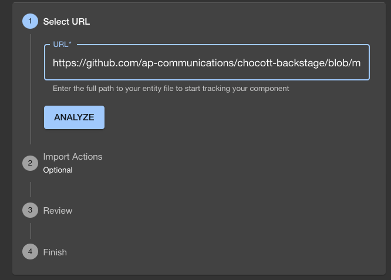
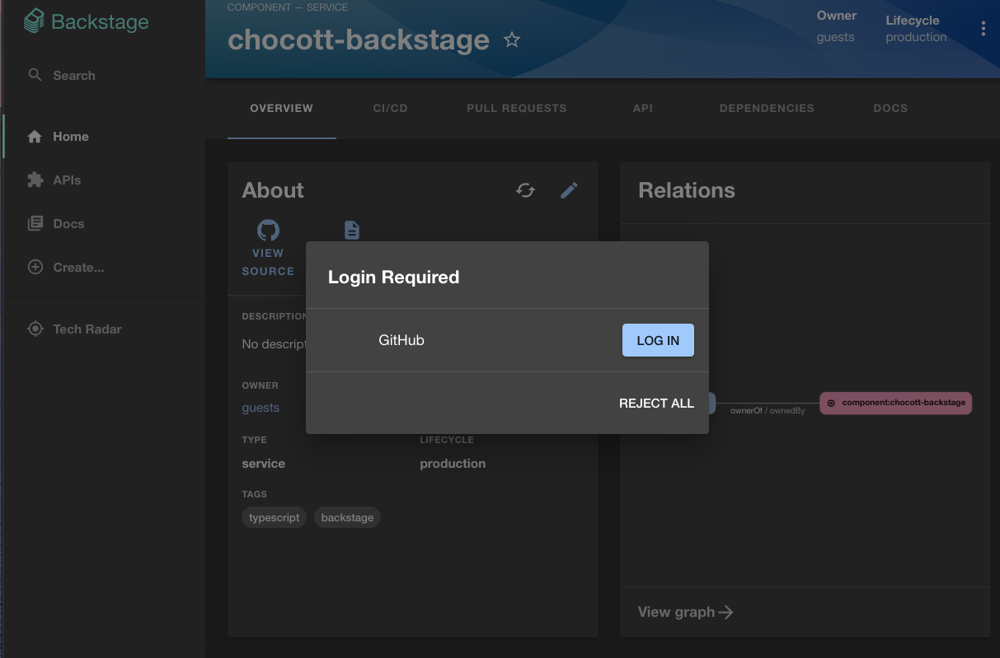
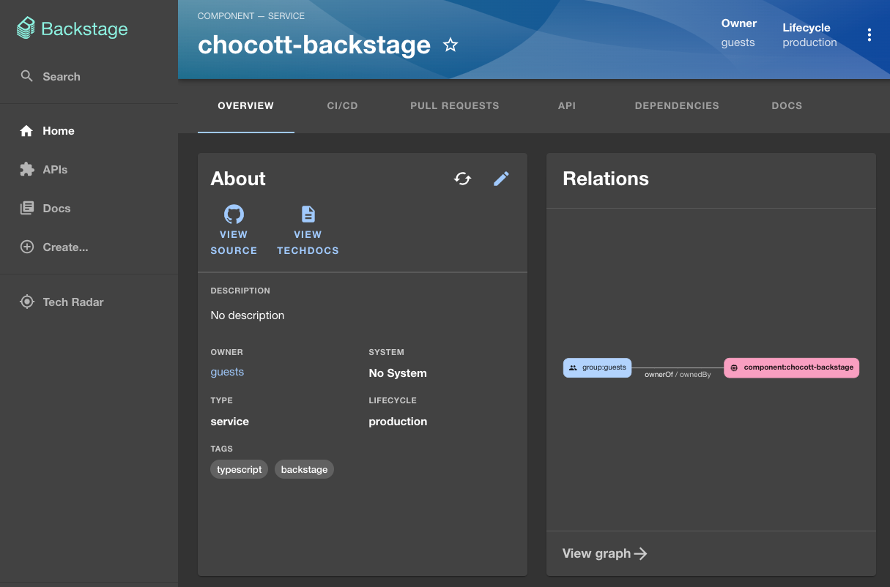
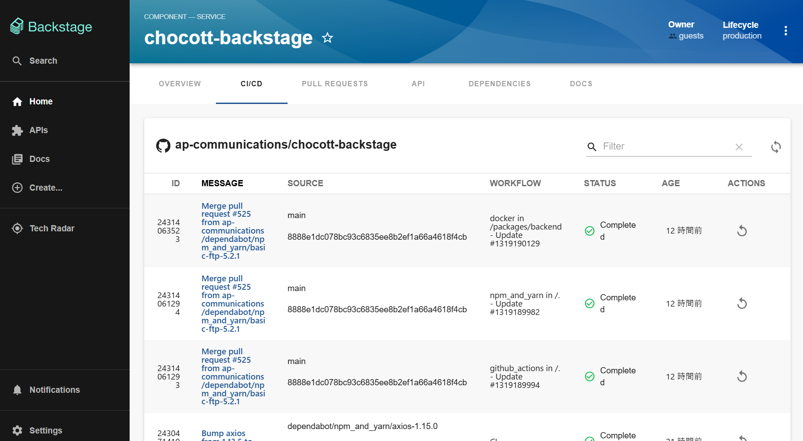
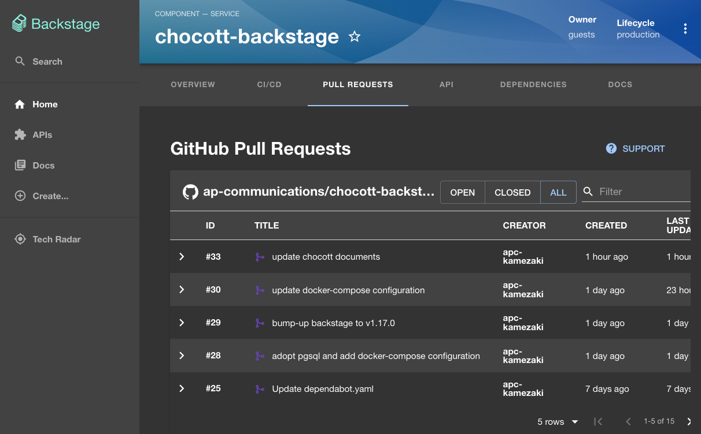
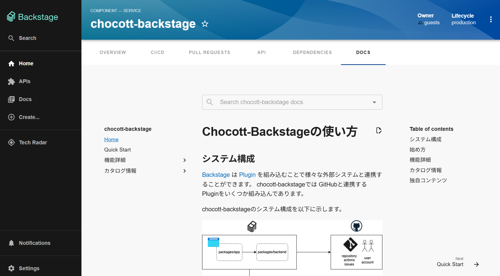

# ソフトウェアカタログ

[ソフトウェアカタログ](https://backstage.io/docs/features/software-catalog/) はBackstageの主要な機能の１つです。
みなさんが開発するソフトウェア・サービスの情報をカタログ情報としてBackstage上で管理します。

chocott-backstageの初期状態ではBackstageが用意しているサンプルカタログのみが見える状態です。ここにカタログを追加していきましょう。

## 1. 既存のカタログのインポート

最初にchocott-backstageのリポジトリ情報を閲覧できるカタログを登録してみましょう。


サイドメニューから `Create...` を選択し、Create a New Component画面で「REGISTER EXISTING COMPONENT」ボタンをクリックします。すると登録画面が表示されます。



Select URLのところに、以下のURLを入力し、「ANALYZE」ボタンをクリックしてください。

```
https://github.com/ap-communications/chocott-backstage/blob/main/chocott-contents/catalog-info.yaml
```

ちなみに実際にブラウザで上記のURLにアクセスするとわかりますが、これはこれから登録するソフトウェアカタログを定義するファイルです。  
Backstageに登録されるエンティティはこのようなyamlファイルで定義されています。

次のような画面が表示されますので、「IMPORT」ボタンをクリックしましょう。


IMPORTが完了すると以下のような画面が表示されます。


ここで「VIEW COMPONENT」をクリックします。

組織利用している場合は、「VIEW COMPONENT」をクリックすると以下のようなダイアログが出ることがあります。  
これはサインイン時の認証とは別にGitHubへのアクセストークン取得のためのものとなっています。「LOG IN」ボタンをクリックして先に進んでください。



「VIEW COMPONENT」をクリックすると、IMPORTしたカタログ情報が表示されます。
こちらが最新のchocott-backstageリポジトリの情報です。



`CI/CDタブ` ではchocott-backstageリポジトリにおけるGitHub Actionsの実行結果を見ることができます。



 `PULL REQUESTSタブ` ではその時点でのPull Requestの一覧が表示されます。  
Pull Request一覧の画面で、「ALL」を選択すると過去にマージ／クローズしたPull request一覧が表示されます。



`DOCSタブ`ではこのリポジトリ内に登録されているドキュメントを閲覧することができます。



## 2. 新規カタログの作成（既存のリポジトリがある方向け）

用意したBackstageが監視可能な範囲に既存のGitHubリポジトリをお持ちの方は、そのGitHubリポジトリ用のカタログを作成し、Backstageに取り込んでみましょう。  
（Organization単位でBackstageを用意した方は同じOrganization内のリポジトリが、個人単位で用意した方は同じアカウントで管理しているGitHubリポジトリ専用のカタログを新規作成することが可能です）

### catalog-info.yamlの作成

カタログ情報は、通常それぞれのリポジトリのリポジトリルートにcatalog-info.yamlというファイルを作成し、それを上記の既存カタログのインポートによって取り込みます。  
※chocott-backstageでは、独自で追加したものはできるだけchocott-contentsフォルダ以下に保存するようにしたため、意図的にchocott-contentsフォルダ直下に配置しています

一番簡単なカタログ情報の内容は以下の通りです。  
なお、カタログ情報の種別や詳細は[Backstage公式ドキュメント](https://backstage.io/docs/features/software-catalog/descriptor-format) をご確認ください。

```yaml
apiVersion: backstage.io/v1alpha1
kind: Component
metadata:
  name: <サービス名称 半角英数や-_といった記号で指定> # Backstage上のカタログ内で一意であれば問題ない
  annotations:
    github.com/project-slug: <GitHubユーザー名>/<リポジトリ名> 
    # github.com/project-slug: <GitHub Organization名>/<リポジトリ名> # Organization利用の場合は1行上をコメントアウトし、こちらを有効化
spec:
  type: service
  owner: guests
  lifecycle: experimental
```

Backstage上のカタログで表示させたいGitHubリポジトリのリポジトリルートにcatalog-info.yamlという名前で作成し、上記のyamlファイルをコピーしてそのまま貼り付けてください。  
そのうえでご自身の環境に合わせて `metadata.name` や `metadata.annotations` の内容を書き換えてmainブランチにコミットしましょう。

その後、[既存のカタログのインポート](#既存のカタログのインポート)手順と同じように 作成したcatalog-info.yamlのURLで登録してください。  
カタログインポートが完了後、`github.com/project-slug` パラメータに記載されたリポジトリからPull RequestsやCI/CDのタブに表示する情報を取得します。

## ソフトウェアカタログを利用する利点

１つのリポジトリだけですと、「GitHubの画面をみればいいのでは？」と思うかもしれません。

では、3つ以上のリポジトリで開発をしている場合はどうでしょうか？
GitHubの画面で確認する場合、あちこちの画面をいったりきたりしなければなりません。  
ソフトウェアカタログという形にまとめれば、比較的容易にGitHubのPull Requestの状況やGitHub Actionsの実行結果を確認することができます。

また、Backstageで用意されているPluginはそれだけではありません。すでに様々な外部サービスと連携する [Plugin](https://backstage.io/plugins) が提供されています。そうしたPluginを利用することで、複数のサービスの状況をBackstage上で簡単に確認することができるようになります。

さらにPluginは独自で追加することもできます。OSSで用意されていないならば独自にPluginを開発して、Backstageをより使いやすい環境に拡張することができます。
