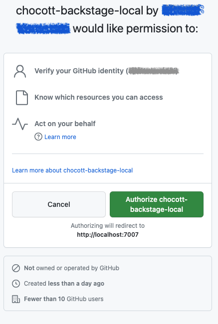

# Chocott-Backstageの使い方

## ユーザー認証

Chocott-backstageはGitHubを利用してユーザーの認証を行います。GitHubで認証を行うにはGitHub Appの登録が必要になります。GitHub Appの登録にはそのアカウントのオーナー権限が必要です。
[authentication](./authentication/index.md) のページにそって、個人アカウントまたは組織アカウントにGitHub Appを登録してください。

## Integration

BackstageのBackend Serverが各外部サービスに連携するための設定が Integration です。
Chocott-backstageはGitHubの連携がありますので、[Integration](./integration/index.md) に沿って登録を進めてください。

# サインイン

## パーミッションの確認

GitHubアカウントで最初にサインインする際、以下のようなダイアログが表示されます。表示されましたら「Authorize ... 」のボタンをクリックしてください。2回目のサインイン時には表示されません。

