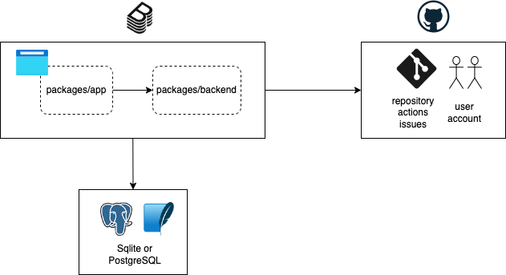

# Chocott-Backstageの使い方

## システム構成

[Backstage](https://backstage.io/) は [Plugin](https://backstage.io/plugins) を組み込むことで様々な外部システムと連携することができます。 chocott-backstageでは GitHubと連携するPluginをいくつか組み込んであります。

chocott-backstageのシステム構成を以下に示します。

## 始め方

chocott-backstageの利用方法は [Quick start](./quick-start/index.md) をご確認ください。

## 機能詳細

- [ユーザー認証](./authentication/index.md)
- [アクセス認可](./authorization/index.md)
- [Integration](./integration/index.md)
- [TechDocs](./techdocs/index.md)
- [Plugins](./plugins/index.md)
- [Database](./database/index.md)

## カタログ情報

- [ソフトウェアカタログ](./catalogs/index.md)
- [ソフトウェアテンプレート](./software-templates/index.md)

## 独自コンテンツ

本リポジトリは基本的に backstageのアプリケーション生成コマンドの出力結果をベースとし、いくつかコードに修正を加えたものとなっています。
以下の部分は独自に追加しております。

- ${TOP}/LICENSE
- $(TOP)/.github
- $(TOP)/chocott-contenets
