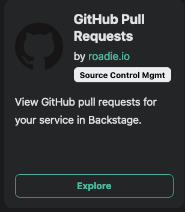
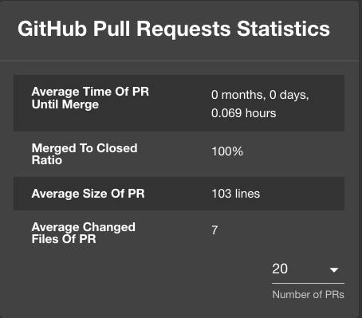
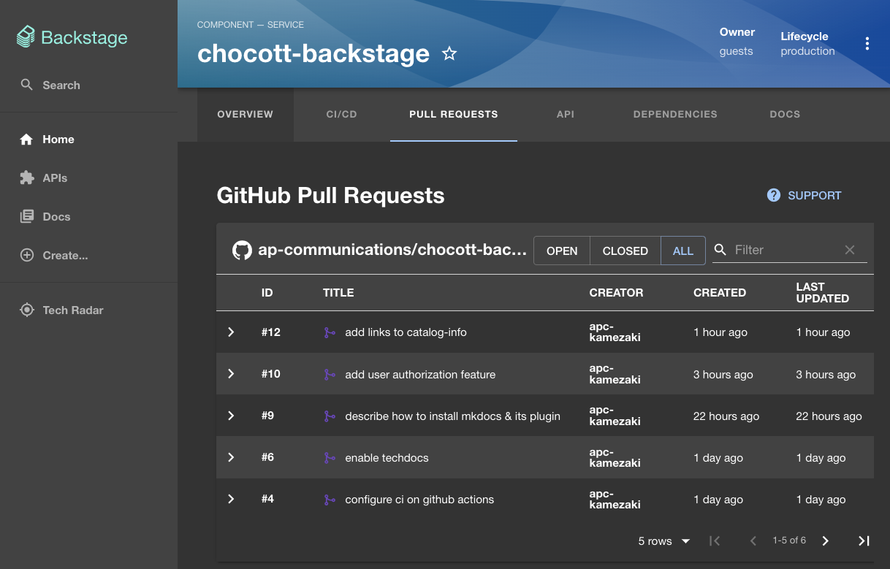

# Plugin導入による機能拡張

BackstageはPluginと呼ばれるパッケージを追加導入することで様々な機能を拡張することができます。
Pluginは [Backstageのサイト](https://backstage.io/plugins) で公開されています。また、これ以外にも [Backstageのソースコード](https://github.com/backstage/backstage/tree/master/plugins)に、サイトには掲載されていないPluginが多数公開されています。



Pluginの導入方法は比較的簡単です。ここでは Roadie社が [Backstageのサイト](https://backstage.io/plugins) で公開している [GitHub Pull Requests Plugin](https://roadie.io/backstage/plugins/github-pull-requests/)を例にその導入方法を見ていきます。

## GitHub Pull Requests Pluginの導入

(Pluginの導入方法は、各PluginのREADME等で紹介されている内容をそのまま実行すれば可能です。)

まず Plugin をインストールします。今回のPluginはfrontend用のパッケージだけですが、Pluginによってはfrontend用、backend用など複数のパッケージをインストールしなければならないものもあります。それぞれのPluginのREADME等をご確認ください。

インストールは以下のようなコマンドを実行します。

```bash
yarn add --cwd packages/app @roadiehq/backstage-plugin-github-pull-requests

```

続いてfrontend側ソースコードを修正します。

```typescript
// File: packages/app/src/components/catalog/EntityPage.tsx
import { EntityGithubPullRequestsContent } from '@roadiehq/backstage-plugin-github-pull-requests';

// ...

const serviceEntityPage = (
  <EntityLayout>
    ...
    <EntityLayout.Route path="/pull-requests" title="Pull Requests">
      <EntityGithubPullRequestsContent />
    </EntityLayout.Route>
    ...
  </EntityLayout>
)
```

また、カタログのoverviewのタブにも情報を表示する場合は以下のコードも追加します。

```typescript
// File: packages/app/src/components/catalog/EntityPage.tsx
import { EntityGithubPullRequestsOverviewCard } from '@roadiehq/backstage-plugin-github-pull-requests';

  // ...
  const overviewContent = (
    <Grid container spacing={3}>
      ...
      <Grid item md={6}>
        <EntityGithubPullRequestsOverviewCard />
      </Grid>
      ...
    </Grid>
  );
```

最新のソースコードは [こちら](https://github.com/ap-communications/chocott-backstage/blob/main/packages/app/src/components/catalog/EntityPage.tsx) です。

## 表示設定

Pull Requestsの内容を表示するためにはカタログ情報に 以下のような `github.com/project-slug` annotationでリポジトリ情報を指定する必要があります。

```yaml
metadata:
  name: sample-service
  annotations:
    github.com/project-slug: owner-name/repository-name
```

chocott-backstageの [カタログコンポーネントの指定内容](https://github.com/ap-communications/chocott-backstage/blob/main/chocott-contents/catalog-info.yaml) を例にすると以下のような内容になります。

```yaml
apiVersion: backstage.io/v1alpha1
kind: Component
metadata:
  name: chocott-backstage
  annotations:
    github.com/project-slug: ap-communications/chocott-backstage
    backstage.io/techdocs-ref: dir:.
  tags:
  - typescript
  - backstage
  links:
  - url: https://github.com/ap-communications/chocott-backstage
    title: project repository
    icon: github
spec:
  type: service
  owner: guests
  lifecycle: production

```

こちらを登録すると

Overviewには以下のような表示が追加されます。



また 「Pull requests」 というタブにPull requestsの一覧が表示されます。



