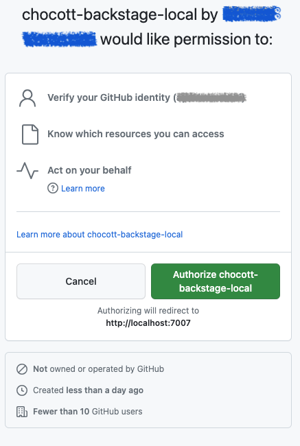

# Organizationアカウントで利用する場合

Organization（組織）アカウントにGitHub Appを登録してchocott-backstageを利用する場合の手順です。

## 前提条件

- macOS、またはWindows（WSL2のUbuntu等）などのLinux環境で作業していること
- GitHubのOrganizationアカウントのオーナー権限を持っていること
- Dockerがインストールされていること

## 手順概要

1. コードのclone
2. GitHub Appの登録
3. GitHub Credentialファイルの作成
4. 環境変数の設定
5. docker composeによる起動
6. 動作確認
7. クリーンアップ

## 1. コードのclone

[本リポジトリ](https://github.com/ap-communications/chocott-backstage)をcloneしてください。

```shell
git clone https://github.com/ap-communications/chocott-backstage.git --depth 1
cd chocott-backstage
```

## 2. GitHub Appの登録

[Authenticationのドキュメント](../authentication/index.md)を参照し、OrganizationアカウントにGitHub Appを登録してください。

登録時の注意点：
- 「Organizationアカウントに作成する場合」の手順に従ってください
- App Install時は「All repositories」を選択することを推奨します

登録後、以下の情報をメモしてください：
- App ID
- Client ID
- Client Secret

## 3. GitHub Credentialファイルの作成

[Integrationのドキュメント](../integration/index.md)を参照し、GitHub Credentialファイルを作成してください。

```shell
cp github-credentials.yaml.sample github-credentials.yaml
```

`github-credentials.yaml`に以下の情報を設定します：
- appId
- clientId
- clientSecret
- webhookSecret（Webhookを使用しないため適当な文字列で可）
- privateKey（GitHub Appで生成したPrivate Key）

## 4. 環境変数の設定

以下の環境変数を設定してください。

```shell
export AUTH_GITHUB_CLIENT_ID="<Client IDの文字列>"
export AUTH_GITHUB_CLIENT_SECRET="<Client Secretの文字列>"
export GITHUB_CREDENTIAL_FILE="$(pwd)/github-credentials.yaml"
export GITHUB_ORG="<Organization名>"
```

> **注意**: `GITHUB_CREDENTIAL_FILE`は絶対パスで指定する必要があります。

`GITHUB_ORG`には、GitHub Appを登録したOrganization名を指定してください。この設定により、Organizationのユーザー・チーム情報がBackstageに取り込まれます。

## 5. docker composeによる起動

```shell
cd chocott-contents/deploy/docker-compose
docker compose up -d
```

アプリケーションが起動します。GitHubからOrganizationのユーザー情報等を取得する時間が必要となるため、起動後少し（10秒程度）お待ちください。

## 6. 動作確認

http://localhost:7007/ にアクセスしてください。GitHubアカウントでサインインできます。

※サインインできるのはあくまでもGitHub Organizationに所属するメンバーのアカウントのみです

GitHubアカウントでBackstageに最初にサインインする際、以下のようなダイアログが表示されます。表示されましたら「Authorize ... 」のボタンをクリックしてください。2回目のサインイン時には表示されません。



無事Backstage Portalにアクセスできれば成功です！


### 補足：クリーンアップ

アプリケーションを停止する場合は以下のコマンドを実行してください。

```shell
cd chocott-contents/deploy/docker-compose
docker compose down
```

データベースのデータも含めてすべて削除する場合は、`--volumes` オプションを追加してください。

```shell
docker compose down --volumes
```