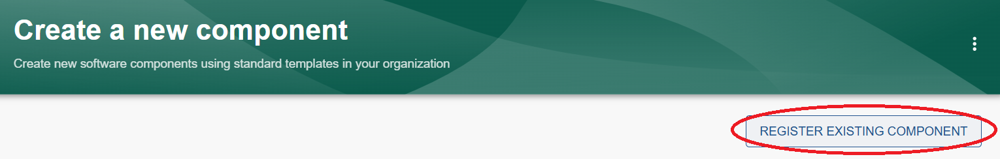
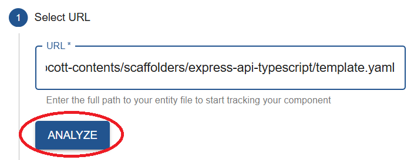
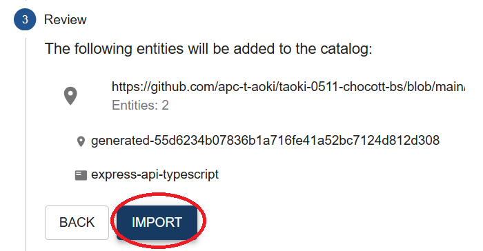
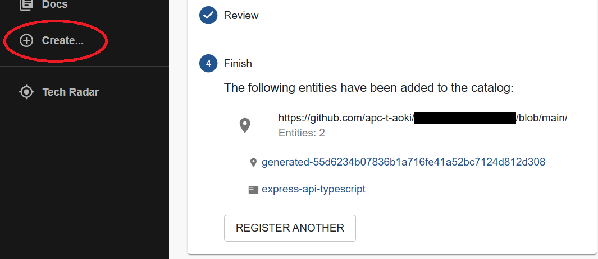
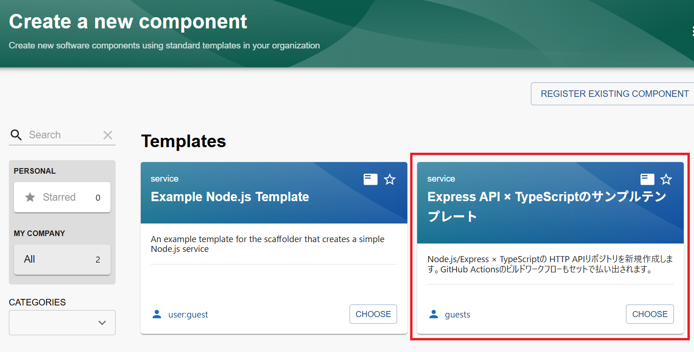

# ソフトウェアテンプレート

ソフトウェアテンプレート機能はBackstageが持つ主要機能のうちの１つです。
テンプレートとして登録された情報を元に、コードリポジトリ等に新たなリポジトリやファイルを追加することができます。

こちらが [公式ドキュメント](https://backstage.io/docs/features/software-templates/) です。

## なぜソフトウェアテンプレートが必要なのか？

新しいプロジェクトやリポジトリを立ち上げる際、テンプレートがない状態では以下のような課題が生じやすくなります。

- フォルダ構成・CI/CD設定・ライブラリ選定などをゼロから決める必要があり、本来の開発以外の作業に時間を取られる
- 担当者やチームによって構成や品質にばらつきが生じる
- 新しいメンバーが参加したとき、どのように始めるかがわかりにくい

ソフトウェアテンプレートを活用すると、こうした課題を解消できます。

- 組織やチームが定めた標準的なリポジトリ構成やリソース設定を、UIベースで必要な情報を入力するだけでセルフサービスで払い出せる
- テンプレートからの払い出しによって組織として統一したいリポジトリ設定やコーディング規約、カタログ登録までを一気通貫で統一して揃えられる
- GitHubに限らず、他のSCMと連携させるようにカスタマイズすることができる
- クラウドベンダーやOSSの各種エコシステムと連携するプラグインを作ることもできる

このように、ソフトウェアテンプレートは **開発者の自律性** と **組織全体の標準化** を両立させるための仕組みです。

## 導入・運用にあたっての注意点

カスタマイズ性が高い分、複雑性や管理の手間も増えやすくなります。

ソフトウェアテンプレートを本格的に活用するためには、事前にアプリケーションの実行環境となるInternal Developer Platform（IDP）の整備や、Software Templateを継続的にメンテナンスするための体制を用意する必要があります。
こうした整備は、一般的に **プラットフォームチーム** と呼ばれる専門チームが担当することが多いです。

テンプレートは独自に追加することもできます。以下の手順でBackstageへの登録を行ってください。

## サンプルテンプレートについて

chocott-backstageで利用できるサンプルのテンプレートをいくつか用意しています。

1. [Express API × TypeScriptテンプレート](./express-api-typescript.md)
2. ソフトウェアカタログを追加するテンプレート

## 【テンプレート共通】テンプレート登録手順

ソフトウェアテンプレートはソフトウェアカタログと同様に、Backstageへのインポートが必要です。

サイドメニューから「Create...」をクリックします。

「REGISTER EXISTING COMPONENT」ボタンをクリックします。

Select URLに、登録するテンプレートの`template.yaml`のURLを入力し、「ANALYZE」ボタンをクリックします。

内容を確認し、「IMPORT」ボタンをクリックします。

インポートが完了したら、再度サイドメニューの「Create...」をクリックします。

テンプレートの一覧画面に新しいテンプレートが表示されていれば、問題なく登録ができています。

