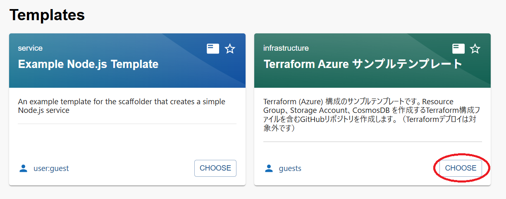
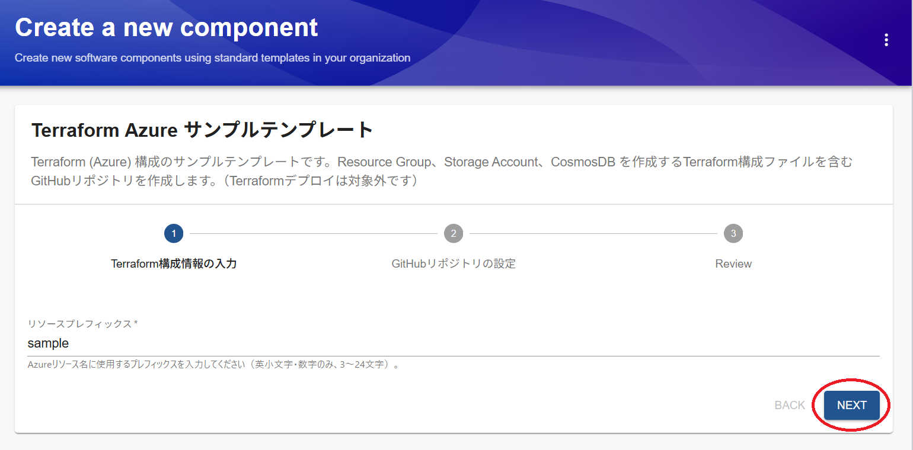
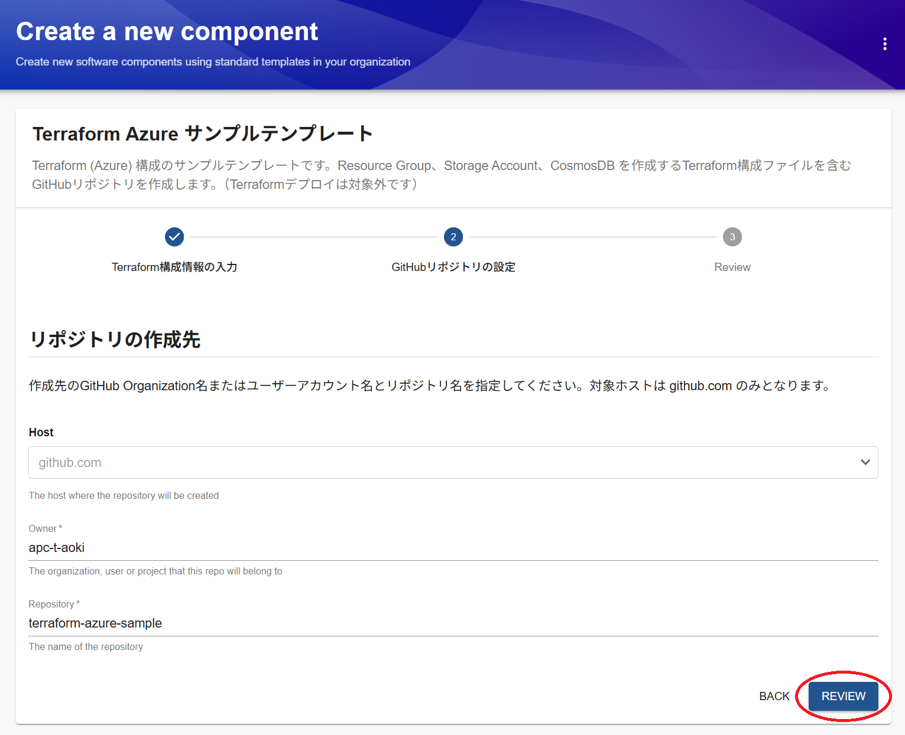
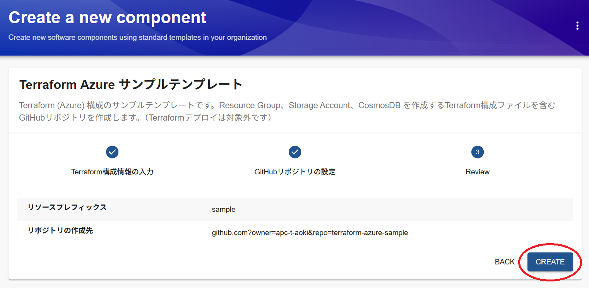
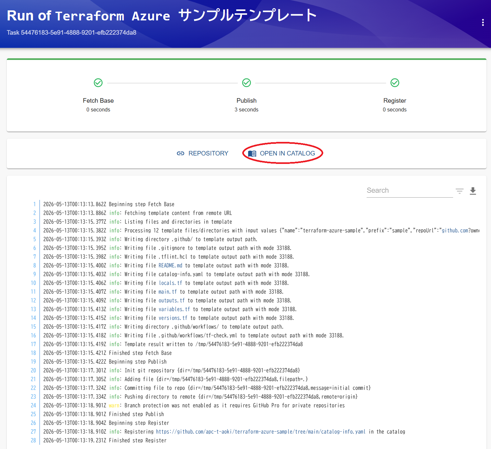
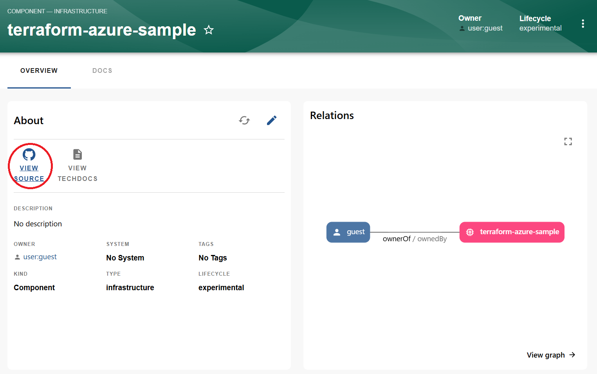
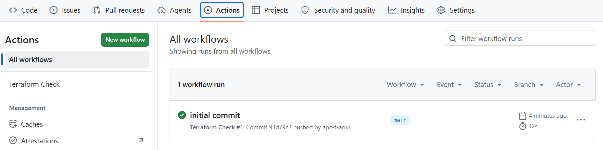

# Terraform Azureテンプレート

このページでは、chocott-backstageで提供しているソフトウェアテンプレートの一つである **Terraform Azureサンプルテンプレート** について説明します。

## テンプレートの概要

Terraform（Azure）構成のサンプルテンプレートです。Resource Group、Storage Account、CosmosDBを作成するTerraform構成ファイルを含むGitHubリポジトリを新規作成します。

> [!NOTE]
> このテンプレートはTerraformの構成ファイルを払い出すものであり、Azureリソースへの実際のデプロイは対象外です。

テンプレート払い出しの手続きと同時に、以下の処理が行われます。

1. テンプレートディレクトリをコピーし、ユーザーが入力した値をコード内に置換
2. 新規リポジトリを作成し、1のコード群をプッシュ
3. コミットを検知し、GitHubワークフローの内容に基づいてGitHub Actionsを実行
4. Backstageのソフトウェアカタログへ登録


## 前提条件

このテンプレートを利用するには、BackstageとGitHubの連携設定が完了している必要があります。  
設定が完了していない場合は [GitHub Integration](../integration/index.md) をご確認ください。

## テンプレートの登録

登録手順は [【テンプレート共通】テンプレート登録手順](./register-software-template.md) を参照してください。
登録するURLを入力する際には、以下のURLを使用してください。

```
https://github.com/ap-communications/chocott-backstage/blob/main/chocott-contents/scaffolders/terraform-azure/terraform-azure-catalog-info.yaml
```

## テンプレートの使い方

左サイドバーの **Create...** からテンプレート一覧を開き、 **Terraform Azureサンプル** テンプレートを選択して **Choose** をクリックします。



フォームに以下の情報を入力します。


| 項目 | 入力する値 |
|---|---|
| リソースプレフィックス | Azureリソース名に使用するプレフィックス（英小文字・数字のみ、3〜24文字） |



入力が完了したら **NEXT** をクリックします。

**Personalアカウント利用時**

| 項目 | 入力する値 |
|---|---|
| Owner | <GitHubアカウント名> |
| Repository | <新しく払い出すリポジトリ名（既存のリポジトリと被らない名前を指定）> |

**Organization（組織）アカウント利用時**

| 項目 | 入力する値 |
|---|---|
| Owner | <GitHub Organization名> |
| Repository | <新しく払い出すリポジトリ名（Organizationにある既存のリポジトリと被らない名前を指定）> |

入力が完了したら **REVIEW** をクリックします。



入力した内容を確認し、 **CREATE** をクリックして作成を行います。



無事に作成されたら**OPEN IN CATALOG**をクリックし、ソフトウェアカタログに登録されたコンポーネントを開きます。  
エラーが発生した場合は、ログを確認してください。



カタログページの **VIEW SOURCE** リンクからGitHubリポジトリにアクセスできます。



リポジトリ作成後、自動的にGitHub Actionsが起動します。生成されたリポジトリのActionsタブでTerraformのフォーマットチェック・Lintチェックのワークフローが正常に完了していることを確認してください。



## このテンプレートで何がわかるか

このテンプレートの内容を見ていただくことによって、「コード化されていれば、ソフトウェアテンプレートで提供できるのはアプリケーション開発環境だけでなく、インフラ環境も対象になる」ということがわかるかと思います。

今回はchocott-backstageをどの環境でご利用いただいても動作するレベルのシンプルな構成のテンプレートにとどめていますが、
実際にはterraform planやterraform applyなどのステップや、事前のご利用のクラウドへのログインなどのステップを組み込むことでデプロイまでを一気通貫に行うテンプレートを作ることができます。

ただし、実際にインフラテンプレートを扱う場合は、ソフトウェアテンプレートから払い出したタイミングでアプリチームの利用して良いインフラ払い出し環境や、払い出しに使用する認証情報、その認証情報に付与すべき適切な権限の範囲などをあらかじめ検討し、繰り返し払い出してもインフラ環境全体が混乱しないような持続可能なテンプレートを作る必要があります。  

場合によっては事前に払い出される側のインフラ環境を整備しておく必要性も出てくるため、テンプレート設計する際には様々な観点で検討しながら進めていくことをお勧めします。

## 次のステップ：他のテンプレートを試す

このテンプレート以外にもいくつかテンプレートをご用意しています。  
[サンプルテンプレート](./index.md#サンプルテンプレート)からぜひ試してみてください。
