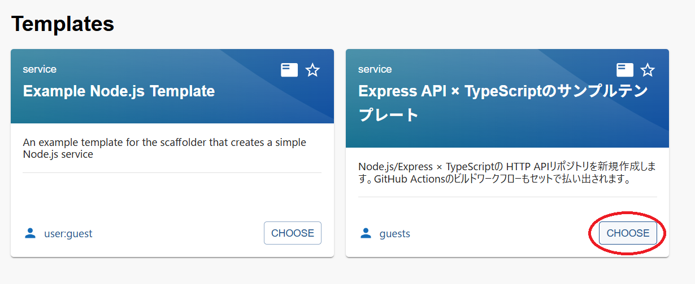
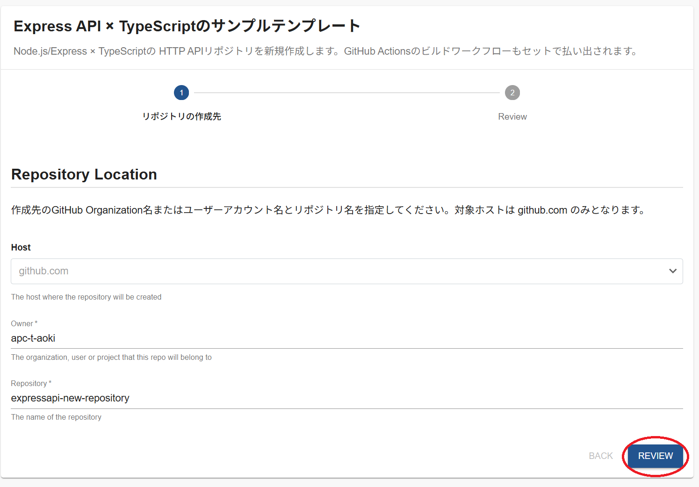
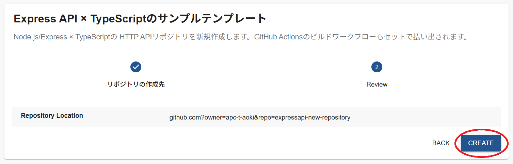
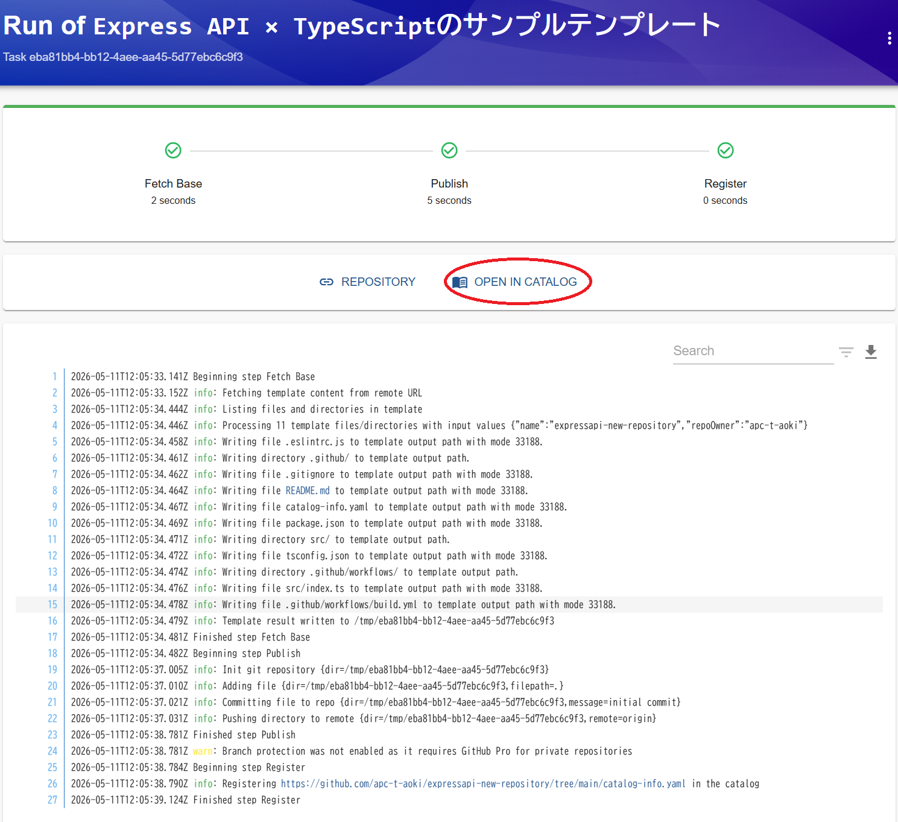
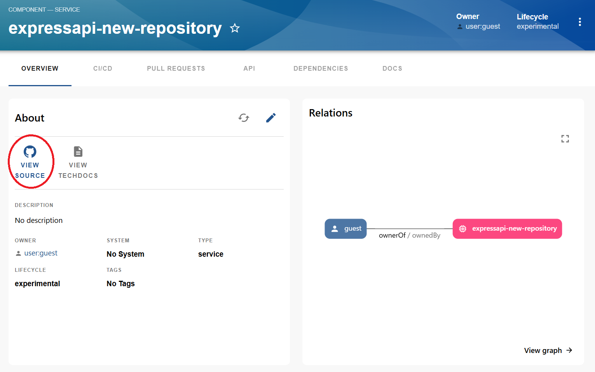
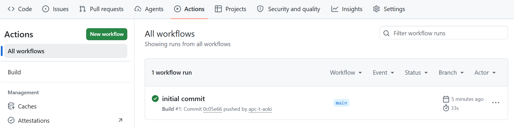
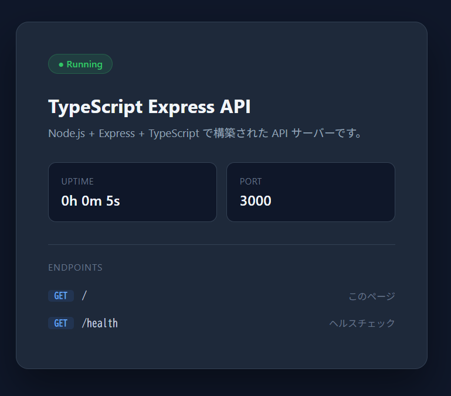

# Express API × TypeScriptテンプレート

このページでは、chocott-backstageで提供しているソフトウェアテンプレートの一つである **Express API × TypeScriptテンプレート** について説明します。

## テンプレートの概要

Node.js/Express × TypeScriptのHTTP APIリポジトリを新規作成するテンプレートです。

テンプレート払い出しの手続きと同時に、以下の処理が行われます。

1. テンプレートディレクトリをコピーし、ユーザーが入力した値をコード内に置換
2. 新規リポジトリを作成し、1のコード群をプッシュ
3. コミットを検知し、GitHubワークフローの内容に基づいてGitHub Actionsを実行
4. Backstageのソフトウェアカタログへ登録


## 前提条件

このテンプレートを利用するには、BackstageとGitHubの連携設定が完了している必要があります。  
設定が完了していない場合は [GitHub Integration](../integration/index.md) をご確認ください。

## テンプレートの登録

登録手順は [【テンプレート共通】テンプレート登録手順](./register-software-template.md) を参照してください。
登録するURLを入力する際には、以下のURLを使用してください。

```
https://github.com/ap-communications/chocott-backstage/blob/main/chocott-contents/scaffolders/express-api-typescript/express-api-typescript-catalog-info.yaml
```

## テンプレートの使い方

左サイドバーの **Create...** からテンプレート一覧を開き、**Express API × TypeScript** テンプレートを選択して **Choose** をクリックします。



フォームに以下の情報を入力します。

**Personalアカウント利用時**

| 項目 | 入力する値 |
|---|---|
| Owner | <GitHubアカウント名> |
| Repository | <新しく払い出すリポジトリ名(既存のリポジトリと被らない名前を指定)> |

**Organization（組織）アカウント利用時**

| 項目 | 入力する値 |
|---|---|
| Owner | <GitHub Organization名> |
| Repository | <新しく払い出すリポジトリ名(Organizationにある既存のリポジトリと被らない名前を指定)> |

入力が完了したら **REVIEW** をクリックします。



入力した内容を確認し、 **CREATE** をクリックして作成を行います。



無事に作成されたら **OPEN IN CATALOG** をクリックし、ソフトウェアカタログに登録されたコンポーネントを開きます。  
エラーが発生した場合は、ログを確認してください。



カタログページの **VIEW SOURCE** リンクからGitHubリポジトリにアクセスできます。



リポジトリ作成後、自動的にGitHub Actionsが起動します。生成されたリポジトリのActionsタブで初回ワークフローが正常に完了していることを確認してください。



## 払い出し後の確認

払い出されたリポジトリをローカルにクローンして、以下のコマンドで確認してみることもできます。

```shell
$ npm install
$ npm run dev

> expressapi-new-repository@1.0.0 dev
> ts-node src/index.ts

Server is running on port 3000
```

`http://localhost:3000/`でアクセスすると、サンプルアプリが起動しているのがわかります。



## このテンプレートで何がわかるか

このテンプレートを通じて、ソフトウェアテンプレートとGitHubの仕組みを組み合わせることで、リポジトリの払い出し・CI/CDパイプラインの実行・ソフトウェアカタログへの登録までを一気通貫に行えることが確認できたかと思います。

このサンプルはシンプルな構成にとどめていますが、実際の運用に向けてテンプレートをカスタマイズする際は、たとえば以下のような内容を盛り込むことが考えられます。

- 組織内で推奨されているアプリケーションスタックや設定をあらかじめ組み込んだサンプルコードを含める
- GitHub Actionsワークフローに、組織標準のLintチェック・フォーマットチェック・セキュリティスキャンのステップをあらかじめ定義しておく
- アーキテクチャの構成や運用方法をまとめた利用ガイドをテンプレートに含め、TechDocsとしてカタログページから参照できるようにしておく

こうしたカスタマイズを加えることで、払い出し時に必要な各種手続きをプラットフォームチームの直接支援を介することなく、開発チームがセルフサービスで完結できるようになります。

## 次のステップ：他のテンプレートを試す

このテンプレート以外にもいくつかテンプレートをご用意しています。  
[サンプルテンプレート](./index.md#サンプルテンプレート)からぜひ試してみてください。