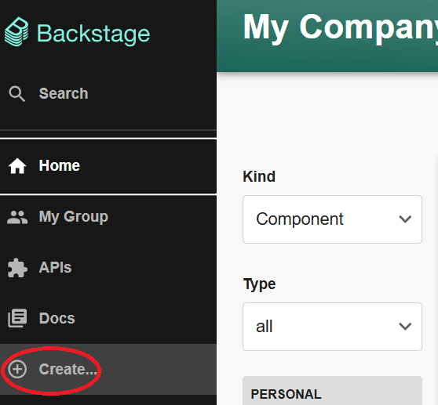
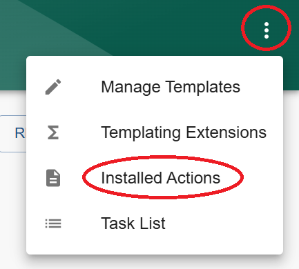
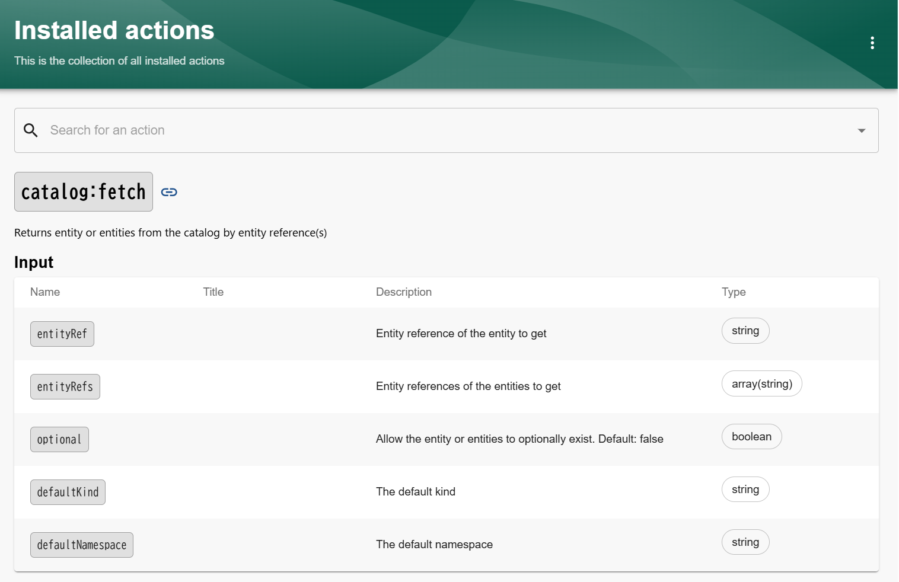
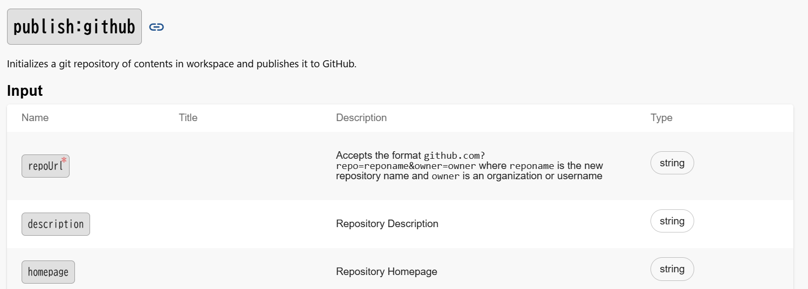
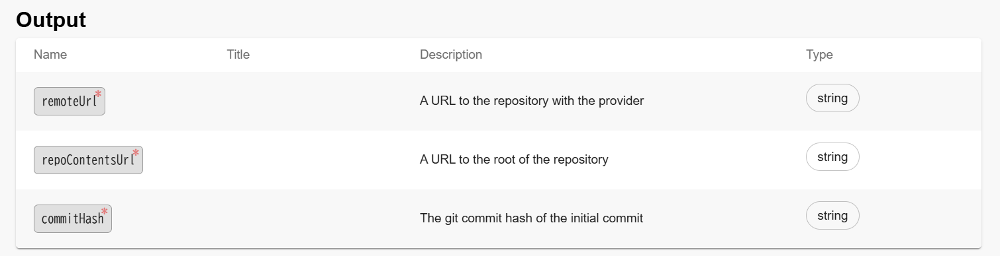
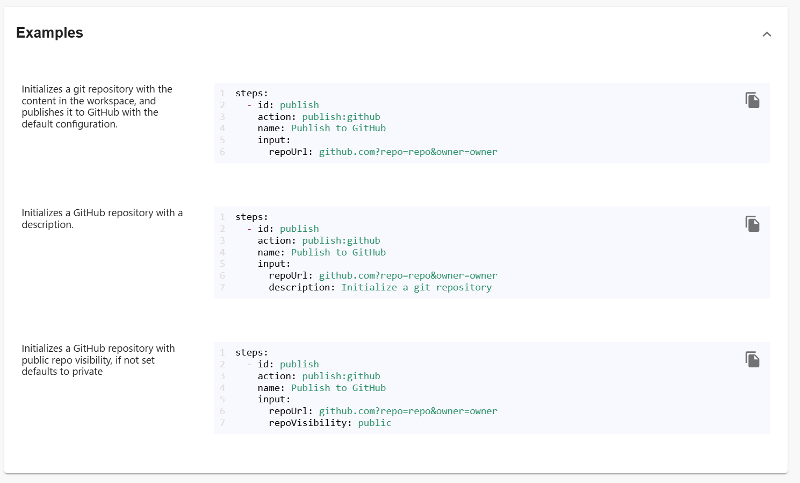

# 【補足】テンプレートを作りたい方へ

## ソフトウェアテンプレートの書き方の基礎を学ぶ

ソフトウェアテンプレートのyamlファイルを書きたい方は、まずは公式のページを参照するのがおすすめです。

- [Writing Templates](https://backstage.io/docs/features/software-templates/writing-templates/)

## chocott-backstageで利用できるテンプレートアクションの確認方法

chocott-backstageでどのようなテンプレートアクションが利用できるかを確認する手順を紹介します。

サイドメニューから「Create...」をクリックします。

「...」をクリックし、「Installed Actions」をクリックします。

こちらで、ソフトウェアテンプレートで利用可能なアクションのチェックができます。

例として、GitHubリポジトリを作成する`publish:github`アクションを見てみましょう。  

**Input**

**Output**

**Examples**

このように、利用できるInput、Output、Examplesを見て、テンプレート作成に生かすことができます。

chocott-backstageに登録されているものだけでも様々なアクションが用意されていますので、どんなアクションがあるかぜひチェックしてみてください。
